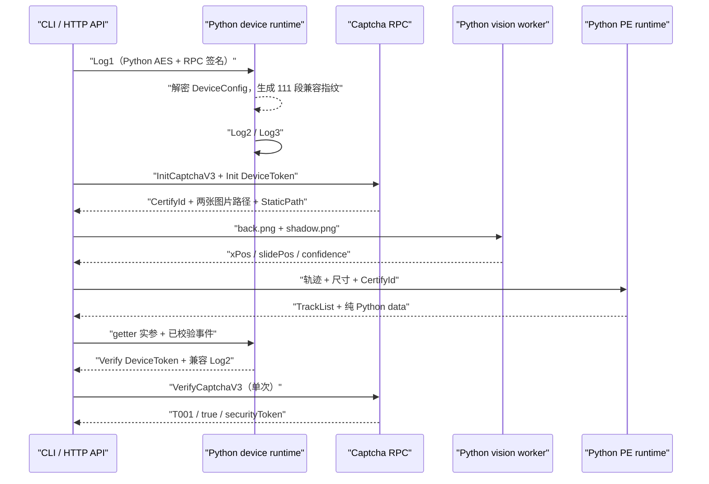

# 阿里滑块纯 Python 迁移报告

日期：2026-08-07
结论：完成；当前工作树的生产、测试与打包路径不再依赖 Node.js 或 JavaScript 补环境，
并已在无 Node `PATH` 中取得真实 `T001`。

> 仅用于用户已明确授权的本地研究、兼容性验证与测试环境。报告不包含
> DeviceToken、DeviceConfig、CertifyId、securityToken 正文或指纹明文。

## 1. Scope

本次范围是把原先的“Python 编排 + Node VM 执行 SDK/FeiLin/动态 PE”迁移为纯
Python 计算，并保持 CLI、HTTP API、桌面入口和快速会话池可用。验收同时覆盖：

- 源码与调用链没有 Node/JS 执行依赖；
- Python 单测、编译、静态检查通过；
- wheel 不携带旧 bridge 或 Node runtime；
- `PATH` 不含 Node 时完成一轮真实 Init → 图片识别 → PE → Verify；
- Verify 返回 T001、true 与非空 securityToken。

本次不把原生 FeiLin collector 的字节级复刻列为验收项。当前设备遥测使用服务端
已经接受的 111 段/cost=0 兼容归一化，边界详见第 6 节。

## 2. 最终结构



生产代码唯一保留的子进程用途是用指定 Python 解释器运行 OpenCV worker；它不调用
Node、JavaScript runtime 或浏览器。

## 3. 主要改动

### 3.1 新增纯 Python runtime

- `ali_slider_reverse/runtime/device.py`
  - Python 生成 Log1 并完成 RPC v1 HMAC-SHA1 签名；
  - AES-CBC 解密并严格解析 DeviceConfig；
  - 生成 session 绑定的 DeviceToken、兼容 Log2/Log3；
  - 跨 Init/Verify 保存会话状态；
  - 初始化失败时关闭部分 HTTP session；
  - 限制远端时间戳导致的真实等待。
- `ali_slider_reverse/runtime/pe.py`
  - 生成 TrackList、RAF 尾事件、xPos/slidePos；
  - 生成已知 StaticPath 的 arg，未知版本回退为服务可接受的同形值；
  - 生成并反向解包验证完整 `data`；
  - 明确 getter 元数据是协议公式导出的计划，不是浏览器观测。

### 3.2 协议补全

- `protocol/device_token.py` 增加 AES-CBC 加密；
- `protocol/data_codec.py` 增加 PE data 正向封装与 15-byte 随机前缀；
- `protocol/secrets.py` 增加设备 RPC/日志所需的公开前端静态材料恢复；
- 保留本地正反向校验，不在普通日志打印敏感值。

### 3.3 调用链与发布清理

- session、快速池、CLI、API、桌面入口全部改用 Python runtime；
- 删除 `runtime/node_device.py`、`runtime/node_pe.py`；
- 删除 `runtime/bridges/sdk_device_bridge.mjs`、`pe_data_bridge.mjs`；
- 删除 Node bridge 测试；
- 删除 `--node`、`--sdk-js`、`--vms-per-node` 等有效参数；
- 删除 package-data、PyInstaller、PowerShell、GitHub Actions 中的 Node 下载和 JS 资产；
- 项目版本升级为 3.0.0。

## 4. Evidence → Finding → Path

| Evidence | Finding | Implemented path |
|---|---|---|
| 31 个保存的 `3.29.0/pe.*` 分片与受控轨迹差分 | TrackList 字段、data key、RAF 尾项和随机前缀跨分片稳定 | `runtime/pe.py` + `protocol/data_codec.py` |
| Python Log1 与迁移前请求表单对照，真实响应可解密 | Log1、DeviceConfig、RPC v1 可脱离 SDK 直接计算 | `runtime/device.py` + `protocol/signing.py` |
| 首版纯 Python Verify 为 F001；修复 sessionId 派生的 fingerprint[21] 后 T001 | index 21 是会话绑定字段，不是随机画像 | `_session_probe()` |
| 纯 Python PE + 对照设备链真实 T001 | Verify data 不需要执行动态 PE 脚本 | `PeRuntimeClient.build()` |
| 全纯 Python 111 段兼容链真实 T001 | 当前服务端接受归一化设备遥测 | `DeviceRuntimeSession` |
| XHR.send 离线探针：settled Log2 高置信关联 142 段、动态 cost；getter 后未见额外 Log2/Log3 | 兼容路径不能宣称原生 collector 字节级/生命周期精确复刻 | README、代码注释与报告明确边界 |
| 全源扫描、AST import、parser 枚举、wheel 内容检查 | 当前工作树和发布物没有 Node/JS 执行依赖 | 删除旧 runtime/bridge/参数/资产 |

## 5. 验证结果

### 5.1 无 Node PATH 单元测试

命令：

```bash
env PATH=/usr/bin:/bin \
  .venv/bin/python -m unittest discover -s tests -p 'test_*.py'
```

结果：

```text
Ran 35 tests in 2.361s
OK
```

覆盖包括 DeviceConfig/DeviceToken/Log2/Log3 离线解密、会话隔离、池复用、初始化
异常清理、PE data 正反向、轨迹合同、输入边界、HTTP API 与桌面启动模式。

### 5.2 编译、导入与静态质量

```bash
env PATH=/usr/bin:/bin .venv/bin/python -m compileall -q \
  ali_slider_reverse tests

.venv/bin/python -m ruff check ali_slider_reverse tests \
  --select E,F,I,UP,B --output-format concise

git diff --check
```

结果：全部退出码 0；Ruff 输出 `All checks passed!`。

在同一无 Node PATH 中枚举并导入 29 个生产模块：

```text
{'node': None, 'imports': 29}
```

### 5.3 依赖与发布物扫描

生产源扫描只命中两处“不依赖 Node”的说明和一组确认旧参数被拒绝的负向测试；实际
`.js/.mjs/.cjs/package.json` 文件为 0。Python AST import 扫描没有 Node、execjs、
quickjs 或 js2py import。

使用本机已有 setuptools/wheel 构建：

```text
ali_slider_reverse-3.0.0-py3-none-any.whl
files=37
forbidden=[]
sha256=7f188700820071d5b6d33c98f2c0ace4c090a7f5a92e039117570536012835e8
```

`forbidden` 检查覆盖 `.js/.mjs/.cjs`、`node_device`、`node_pe` 与 `/bridges/`。

### 5.4 最终在线验收

环境：

```bash
env PATH=/usr/bin:/bin .venv/bin/python <授权在线验收脚本>
```

安全摘要：

```json
{
  "nodeOnPath": null,
  "verifyCode": "T001",
  "verifyResult": true,
  "succeeded": true,
  "securityTokenLength": 128,
  "deviceSource": "python-compatible",
  "deviceActions": ["Log1", "Log2", "Log3", "Log2"],
  "sameGatherCost": true,
  "fingerprintFields": 111,
  "trackEvents": 81,
  "dataMousemoveEvents": 82,
  "confidence": 0.992522,
  "httpRequestCount": 8,
  "scriptRequestCount": 0
}
```

这轮完整执行了设备链、Init、两图下载、OpenCV 识别、PE data、设备 token 刷新和
一次 Verify。没有打印或保存 token 正文。

## 6. 兼容性边界

当前结果可以准确表述为：

> 生产运行链已完全 Python 化，当前服务端在线 Verify 已验证成功。

不能表述为：

> 已逐字节复刻原生 FeiLin collector。

原因是 settled SDK 探针显示原生采集具有更完整的 142 段遥测、动态 collector cost
和不同的异步上报生命周期；当前服务端不要求这些值才能通过 Verify。为了避免把未
闭环的原生复刻冒险带入已获 T001 的主链，本次保留稳定兼容路径，并在类型名、CLI
摘要、注释和文档中删除 `native matched`、`observed`、`replayed` 等错误声明。

未来如果验收标准改为 byte-exact parity，应单独完成：sent-inner ciphertext equality、
142 字段语义、动态采集耗时和真实浏览器生命周期回归；这不是修复当前业务功能所必需。

## 7. 可重复命令

```bash
# 测试
env PATH=/usr/bin:/bin \
  .venv/bin/python -m unittest discover -s tests -p 'test_*.py'

# 编译与 lint
env PATH=/usr/bin:/bin \
  .venv/bin/python -m compileall -q ali_slider_reverse tests
.venv/bin/python -m ruff check ali_slider_reverse tests \
  --select E,F,I,UP,B --output-format concise
git diff --check

# 旧依赖扫描
rg -n 'runtime\.node_|\.mjs|ALI_SLIDER_NODE|sdk_device_bridge|pe_data_bridge' \
  ali_slider_reverse packaging pyproject.toml .github tests

# CLI
.venv/bin/python -m ali_slider_reverse --help
.venv/bin/python -m ali_slider_reverse run --help
```

在线 Verify 会消耗一枚新挑战，只应在明确授权环境中按需执行，不应放进普通 CI。
