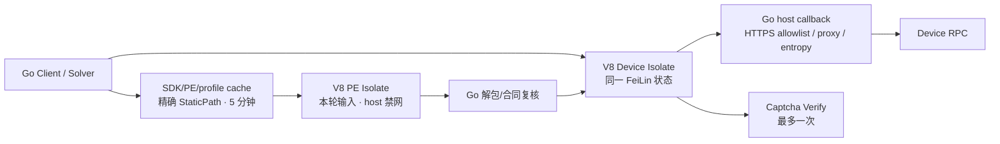

# Ali Slider 内嵌 V8 运行时迁移报告

> 本文是“恢复动态语义”阶段的历史快照。后续性能优化在保留动态 V8 oracle/fallback 的前提下增加了精确分片纯 Go 快路、5 分钟 SDK 软 TTL 和 30 分钟 PE 硬 TTL。当前状态以 [2026-08-09 性能证据](./evidence/validation-2026-08-09-performance.md) 为准。

## 执行摘要

早期 Go 迁移失败的核心不是 IP，而是丢失动态运行时语义：它曾用静态 key/近似 Go payload 代替“同挑战 Device VM 状态 + 当轮 PE 脚本”。当前候选已用 Go 进程内 V8 `149.4.0` 恢复该语义，生产不启动 Node。

验证结果：Linux AMD64/ARM64 的 Rust native 和 Go→V8 ABI 测试通过；Windows AMD64 DLL 交叉构建、导出符号和系统 DLL 依赖检查通过；Linux AMD64 最终 Debian/glibc 包的生产 Device/PE 组件探针以 `2.78s` 通过。该探针不创建 Captcha Init/Verify，因此本报告不声称完整 Solve 成功率或 P95/P99 已通过。

## 范围

- 授权范围：见 [v8-runtime-migration-scope.md](./evidence/v8-runtime-migration-scope.md)。
- 时间线：见 [v8-runtime-migration-timeline.md](./evidence/v8-runtime-migration-timeline.md)。
- 对照 commit：`d92c7d1760b416badb06cac04018106904f7cade`。
- 当前工作树：未提交候选；正式发布证据须以最终 commit/CI 重跑。

## 方法

1. 对比旧动态路径与早期 Go 近似路径的状态、脚本和缓存所有权。
2. 保留旧 Node bridge 仅作测试 oracle，将生产构造器切换为 V8 wrapper。
3. 以 C ABI 分割 Go/Rust：Go 负责 HTTP、代理、随机源、JSON 合同和结果复核；V8 只执行当前公开 JS。
4. 以真实平台动态库执行 native/ABI 测试，不以交叉编译代替 Linux 执行。Windows 执行由发布 CI 补齐。
5. 用最终 Linux AMD64 Debian/glibc 包的真实 `.so`，在 `CGO_ENABLED=0` 测试进程中运行显式在线的生产 Device/PE 组件探针。

## 调用路径



状态分界：

- 可 5 分钟复用：公开 SDK 源码、精确 PE 源码、对应结构画像。
- 不得跨轮复用：DeviceToken、`CertifyId`、DeviceConfig、轨迹、逻辑时钟、`data`、Verify 尝试位。
- 每个live Device slot使用独立画像；默认直连公开组件A/B确认预热池最多安全保留4个Isolate。预热会话最多空闲20秒且一次性消费；它不是分钟级token缓存。

## Evidence

| ID | 来源/命令 | 范围 | 时间 | 内容哈希 | 关键结果 |
|---|---|---|---|---|---|
| E-001 | Git 对照 `d92c7d1`与当前 `internal/pe` | 只读源码对比 | 2026-08-08/09 | n/a（Git commit 已定址） | 旧路径保持 FeiLin VM 并执行当轮 PE；失败迁移曾改为静态/近似。 |
| E-002 | `docker buildx build --platform linux/amd64 --target native-test .` | Linux AMD64 Rust wrapper | 2026-08-09 | n/a（命令输出） | 6 项 Rust 测试通过。 |
| E-003 | `docker buildx build --platform linux/amd64 --target v8-test .` | Linux AMD64 Go→V8 | 2026-08-09 | n/a | `internal/v8runtime` 与 `internal/pe` 使用真实 `.so` 通过。 |
| E-004 | 同上命令，`--platform linux/arm64` | Linux ARM64 Rust/Go→V8 | 2026-08-09 | n/a | Rust 6 项与 Go V8 测试通过。 |
| E-005 | `cargo +1.88.0 xwin build --target x86_64-pc-windows-msvc --release --locked`；`file`；`objdump -p` | Windows AMD64 DLL | 2026-08-09 | SHA-256 `de7b40bffe8898a8ff59cff4148cf2a966af6894649271d3c22275cda730f00d` | PE32+ x86-64；12 个 `ali_slider_v8_*` 导出存在；无 `vcruntime*.dll`/UCRT 运行依赖。 |
| E-006 | `go test -run '^TestNodeAndV8BrowserContextContract$' ./internal/pe` | Node 24.14.1 vs V8 149.4.0 测试 oracle | 2026-08-09 | n/a | 上下文合同差异测试通过，约 `0.79s`。 |
| E-007 | `TestOnlineV8DeviceRuntime` | Linux AMD64 最终 Debian/glibc 包、公开 SDK/Device/PE | 2026-08-09 | `.so` SHA-256 `20cfb7d9559d31d9cbbaef067c643dc738e05954009b7c7499b7bb57bb1c8cf8` | `tokenLength=1616`、`dataLength=1164`、142 字段、4 请求，`PASS 2.78s`。 |
| E-008 | `Client.CheckRuntime` + server smoke | 启动边界 | 2026-08-09 | n/a | wrapper 缺失/ABI 错误在 ready 前失败；正确包可启动并返回 `/health`。 |
| E-009 | `ldd`/`objdump -p` | 部署依赖 | 2026-08-09 | n/a | Linux launcher 使用 `libdl`/glibc；Windows wrapper 仅导入系统 DLL。 |
| E-010 | `file`、`readelf -l`、双架构最终镜像 `/health` | Linux 发布包/镜像 | 2026-08-09 | AMD64 launcher/`.so`：`47b07bd2edc7b59b63a92da12d81d583feae7b43dfa66de9e302ab5f0ddba03c`/`20cfb7d9559d31d9cbbaef067c643dc738e05954009b7c7499b7bb57bb1c8cf8`；ARM64：`d6bc1291b354951ec287851db4ed3daf8ace4e73cb9a3f8feaf22cf5a74097a3`/`3ab341a3918a9f1f8706901db2f5a01ce1d7f9892280577f25b266518a052577` | AMD64 与 ARM64 的 launcher/`.so` 分别同架构；解释器为对应 glibc loader；UID/GID `65532` 镜像均返回 ready。 |

## Findings

### F-001：失败根因是动态语义丢失，不是“每次设备必须全新”

- 类型：`reverse_algo/design`
- 置信度：高
- 证据：E-001。
- 结论：可稳定复用的是公开脚本和结构画像；必须逐轮动态的是 Device 会话、挑战输入、轨迹、时钟和 `data`。将后者写死会破坏上游合同。

### F-002：进程内 V8 可在不启动 Node 的情况下恢复当前动态执行

- 类型：`implementation/compatibility`
- 置信度：高
- 证据：E-002、E-003、E-004、E-006、E-007。
- 结论：生产 `KeyResolver` 的 Open/Resolve/Build/Complete 已经过真实 V8 ABI 和公开组件探针。Node 只作可选 oracle，不进入发布包。

### F-003：5 分钟缓存方案可用，但缓存边界必须保持精确

- 类型：`state/cache`
- 置信度：高
- 证据：E-001、`internal/pe/keys.go` 及其 TTL/并发 miss 测试。
- 结论：用户所说的“每几分钟采集替换”对公开 SDK/PE/profile 成立；对 token、`CertifyId`、DeviceConfig、轨迹、时钟或 `data` 不成立。

### F-004：Linux 产物不是单静态 ELF

- 类型：`deployment`
- 置信度：高
- 证据：E-003、E-004、E-009、E-010。
- 结论：每个架构需 Go launcher + V8 `.so`，并由 Debian/glibc 提供动态加载环境。`CGO_ENABLED=0` 只描述 Go 构建边界，不等于完整产物是单文件。

### F-005：Windows 构建形态已确定，原生执行仍是发布门禁

- 类型：`deployment/verification-gap`
- 置信度：中-高
- 证据：E-005。
- 结论：DLL 的 PE 格式、导出和运行依赖已检查；当前机器不能执行 Windows DLL，因此只有 Windows 2025 CI 原生 Rust/Go→DLL/打包 smoke 成功后才能称为 Windows 发布验收通过。

## Paths

### P-001：生产求解路径

`Client` → 同路由 transport → V8 Device Isolate → Captcha Init → 精确 `StaticPath` 缓存/更新 → 禁网 V8 PE Isolate → Go 合同复核 → 同一 Device Isolate Complete → 唯一 Verify。

### P-002：部署失败路径

`cmd/server` → `slider.NewClient` → `Client.CheckRuntime` → 动态库文件/C ABI/V8/ICU 校验。任一失败都在 `event=listen status=ready` 前退出，避免部署后“服务看似正常，但每次 Solve 都失败”。

## 复现命令

```bash
# 常规 Go 门禁
CGO_ENABLED=0 go test -count=1 ./...
CGO_ENABLED=0 go vet ./...

# Linux AMD64/ARM64 真实 V8 native/ABI
docker buildx build --platform linux/amd64 --target native-test .
docker buildx build --platform linux/amd64 --target v8-test .
docker buildx build --platform linux/arm64 --target native-test .
docker buildx build --platform linux/arm64 --target v8-test .

# 导出完整 Linux 产物
make build-linux-amd64
make build-linux-arm64

# 在 Linux AMD64 且受权环境执行公开组件探针
ALI_SLIDER_V8_DEVICE_ONLINE=1 \
ALI_SLIDER_V8_TEST_LIBRARY=/absolute/path/libali_slider_v8_runtime.so \
CGO_ENABLED=0 go test -count=1 -tags online \
  -run '^TestOnlineV8DeviceRuntime$' -v ./internal/pe
```

## 限制与后续门禁

1. Windows DLL 必须在发布 commit 的 Windows runner 原生执行 Rust 单测、Go→DLL 测试和最终 ZIP smoke。
2. 当前 V8 架构的完整 Solve 成功率、P95/P99、RSS、V8 heap、Go GC、goroutine/原生线程峰值和长时间稳定性尚未测量。
3. V8 Isolate 不是 OS 沙箱；native wrapper/V8 错误可影响整个 Go 进程。需持续维护 HTTPS allowlist、PE 禁网、heap/时间/输入输出上限和低权限运行账号。
4. 当前候选尚未提交；本报告的命令结果必须在最终 commit/CI 中重跑后才能转为发布证据。
