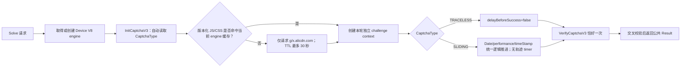

# TRACELESS / SLIDING 运行时性能优化报告

> 风险与统计边界：本报告只覆盖用户明确授权的阿里验证码公开组件单次 smoke 与本地实现优化。在线样本会创建真实验证码挑战，但未调用 PixCake、DJI 登录或短信业务接口。样本数不足以计算成功率、P50/P95/P99；下列数字只能用于同日 first-divergence 对比，不能外推生产容量。

| 项目 | 值 |
|---|---|
| 日期 | 2026-08-11（Asia/Shanghai） |
| 对象 | `TRACELESS` 无感、`SLIDING` 无图拖动 |
| 工作区 | `ali-slider-go` |
| 基线提交 | `cd672563f1c997a90666c8e5698cf8541d20ec85` |
| 报告快照 | 基线提交上的未提交工作树 |
| 工具链 | Go `1.26.5`、Node `v24.14.1`（仅 JS oracle）、V8 wrapper `149.4.0`（Linux ARM64） |
| 核心结论 | 4–5 秒主要来自冷启动、网络 Init/动态资源/Verify，以及旧 SLIDING 按真实墙钟回放逻辑轨迹；自动类型识别不是瓶颈，最终轨迹回放已无真实 timer/macrotask 等待 |

## 1. Executive Summary

本次没有通过缩小 timeout、跳过 Verify 或减少校验伪造“变快”。优化保留自动类型识别、已签发挑战绑定、SDK 内部唯一 Verify、success/Verify 交叉校验和公共返回格式，只处理三个已测量的本地等待或重复工作：

1. `TRACELESS` 显式设置官方配置 `delayBeforeSuccess:false`，关闭成功后再延迟回调的默认行为。
2. `SLIDING` 保留 86 点轨迹和原始逻辑时长，统一推进 SDK 可见的 `Date.now()`、`performance.now()` 与 `event.timeStamp`。轨迹循环只清空 microtask，不调用 `setTimeout`、`wait` 或 macrotask，因此 1.79–2.86 秒逻辑人手节奏不再变成墙钟等待。
3. 生产 V8 路径在单个 Device engine 内短暂缓存公开版本化 CDN 响应。缓存只覆盖 `g.alicdn.com`、`x.alicdn.com` 的安全静态 GET；Init/Verify、token、DOM、挑战状态和不同 engine/代理/画像之间绝不共享。

最终验证使用不含 Node 的 Linux ARM64 容器，显式加载生产 V8 wrapper：

- DJI `SLIDING`：`deviceSession=1058ms / init=296ms / sliding=1390ms / total=2750ms`；
- PixCake `TRACELESS`：`deviceSession=995ms / init=320ms / traceless=1168ms / total=2488ms`。

两个都是单挑战、应用层零重试，`success=1`、业务失败 `0`、错误集合为空，并保持“一次 Solve 最多一次 Verify”规则。`sliding=1390ms` 包含 SDK/动态资源/网络 Verify，不是轨迹 timer；离线同一份 1800ms 逻辑轨迹墙钟约 `2.6–3.0ms`。单样本不计算成功率或分位数。

Node 样本仅保留为调试历史和 JS oracle：600ms 过渡方案曾在 Node 返回 `T001 / true`，但已被上述零墙钟实现取代，不再代表当前代码。

## 2. Scope Summary

### 2.1 授权与数据边界

| 范围项 | 内容 |
|---|---|
| `authorization` | 用户明确要求优化并测试刚完成的 TRACELESS 与 SLIDING 类型 |
| `in_scope` | 当前工作区；阿里公开 Device、Captcha Init/Verify、动态 JS/CSS 与采集端点；Node JS oracle；Linux ARM64 生产 V8 wrapper smoke |
| `out_of_scope` | 登录、发短信、业务提交、批量挑战、绕过服务端校验、成功率或容量压测 |
| `network_profile` | 串行、单挑战、应用层零重试；失败的挑战不重放、不补发 Verify |
| `data_policy` | 只保存类型、阶段聚合、结果码、布尔结果、请求数量和代码位置；不保存挑战 ID、DeviceToken、securityToken、success 原文、Cookie 或代理凭据 |
| `production_boundary` | macOS 本机无 Darwin V8 wrapper；最终在不含 Node 的 Linux ARM64 容器加载仓库 `.so`，走 `pkg/slider` 正式入口验证。单挑战不量化缓存命中收益 |

### 2.2 验收标准

1. 两种类型继续由 Init 的 `CaptchaType` 自动分流，调用方不指定类型。
2. 在线结果仍为官方 `T001 / true`，请求序列和唯一 Verify 合同不变。
3. SLIDING 事件数量、类型、终点和逻辑时间保持不变；轨迹代码不使用真实 timer/macrotask 等待。
4. TRACELESS 使用官方受支持选项，不修改 success 返回格式。
5. 缓存不覆盖挑战 API、敏感请求或不可缓存响应，不跨 Device engine。
6. Node oracle 语法、生产 V8 smoke、专项合同、全量、race、vet、online-tag 编译、格式和 diff 门禁通过。

## 3. 为什么会看到 4–5 秒

在线测试原先只打印整条用例耗时，容易把所有时间误认为“识别验证码类型”。增加阶段计时后，基线拆分如下：

| 类型 | OpenDevice | Init | Solve | Total | 结果 |
|---|---:|---:|---:|---:|---|
| TRACELESS | 881ms | 403ms | 1.507s | 2.791s | `T001 / true` |
| SLIDING | 890ms | 387ms | 2.967s | 4.245s | `T001 / true` |

耗时来源：

- `OpenDevice`：Node smoke 每次创建临时目录、写入 bridge/SDK 文件并启动新 Node 进程。生产构造器使用同进程 V8，并可通过 Device pool 回收 engine；两者不能混为同一冷启动口径。
- `Init`：真实访问阿里 Device/Captcha 服务，受 DNS、TLS、出口、上游和当时网络状态影响。
- 动态组件与 Verify：TRACELESS/SLIDING 都要加载版本化 JS/CSS 并完成真实 Verify。
- SLIDING 轨迹：默认 fixture 为 86 点、逻辑总时长 2233ms；`track.LoadDefault` 的速度系数为 0.80–1.28，旧 bridge 会真实等待约 1.79–2.86 秒。这个本地 sleep 是 SLIDING 比 TRACELESS 明显更慢的主因。
- 自动识别：只是读取 Init 的 `CaptchaType` 并分支，不包含秒级工作。

历史报告中的 `5.58s` 是更早的一次 Node cold smoke。它仍是当时的真实记录，但不是优化后稳定值，也不应改写成生产 V8 延迟。

## 4. Implementation

### 4.1 TRACELESS：关闭官方 success 延迟

`internal/pe/runtime/sdk_device_bridge.mjs` 的 `runTracelessCaptcha` 现在传入：

```javascript
delayBeforeSuccess: false
```

当前公开 `AliyunCaptcha.js` 会校验该字段为 boolean；未显式传 `false` 时默认开启延迟。因此该改动走官方配置合同，不改写 SDK 私有状态，也不跳过 Verify。

离线 mock 同时断言：

- SDK 收到的 `delayBeforeSuccess` 确实为 `false`；
- `captchaVerifyParam` 与 DeviceToken 返回合同不变；
- 仍只接受一份成功结果。

### 4.2 SLIDING：逻辑时间与墙钟时间解耦

旧实现对每个 `sample.dt` 调用真实 timer，并在 `getInstance` 后额外等待 120–260ms。第一次 zero-wall 实验只删除了 sleep：`event.timeStamp` 按轨迹前进，SDK 可见的 `Date.now()` 和 `performance.now()` 却仍是真实墙钟。这会产生“事件已过 1.8 秒，窗口时钟只过几毫秒”的自相矛盾输入，是前两次在线失败的 first divergence，不是“必须真实等待”的证据。

中间版曾使用最多 600ms timer 预算，并在 Node 在线 oracle 返回 `T001 / true`。用户指出生产是 V8 且不应真实等待后，该过渡策略已完全移除。

最终策略复用项目 Puzzle PE 的逻辑时钟模型：

- 每个 browser context 维护独立的逻辑偏移，不跨挑战共享；
- `BrowserDate.now()` 和无参 `new BrowserDate()` 返回宿主时间加逻辑偏移；`performance.now()` 使用同一偏移；
- 回放每点时先按原始 `sample.dt` 推进逻辑时钟，再发送完整 mouse/touch 事件，`event.timeStamp` 保持原始累计时长；
- 点与点之间只 `await Promise.resolve()` 清空当前 microtask，不调用 `wait()`、`nextHostTurn()`、`setTimeout()` 或其他 macrotask；
- `getInstance` 用 `queueMicrotask` 启动拖动，删除 120–260ms 模拟反应时间。

离线合同用 1800ms 逻辑轨迹同时记录三个时钟：`Date`、`performance` 与 `event.timeStamp` 都前进约 1800ms，墙钟仅约 `2.6–3.0ms`。源码合同还直接检查 `replaySlidingTrack` 不含上述三类等待调用。最终在不含 Node 的 Linux ARM64 容器中走正式 `pkg/slider` + V8 wrapper，DJI SLIDING 单挑战 `success=1`、`T001 / true`、零重试。

### 4.3 V8 热态：同 engine 静态资源缓存

`internal/pe/v8_host.go` 新增每个 V8 Device engine 独享的有界缓存，`internal/pe/v8_runtime.go` 在 network-enabled engine 创建时注入。Device pool 的 `Recycle` 会复用同一个 engine，所以后续 challenge context 可以复用静态响应字节；每轮 DOM、VM challenge context 与 Verify 状态仍重新创建。

缓存条件全部满足才可写入：

- 请求是无 body 的 GET，redirect 模式为 `manual`；
- host 精确为 `g.alicdn.com` 或 `x.alicdn.com`，路径限定在 `/captcha-frontend/dynamicJS/` 下的 `.js`/`.css`；
- 请求不含 `Authorization` 或 `Cookie`；
- 响应为 HTTP 200；
- 响应不含 `Set-Cookie`、`Vary:*`、`no-store`、`no-cache` 或 `private`；
- key 包含精确 URL 与排序后的全部请求头；
- TTL 取响应较小的 `max-age`，并由本地上限压到 30 秒；
- 每个 engine 最多 8 项，理论响应体上限 16MiB，实际观察到的动态脚本约 176KiB。

`.aliyuncs.com` 的 Device/Init/Verify 永不缓存。缓存不跨 engine，所以也不会跨代理路由、设备画像或独立 Isolate。最终在线 smoke 已走该 V8 host，证明组件在真实 V8 路径可用；但本次 `prewarm=0`、每类只一个挑战，没有对同 engine 二次命中做延迟分解，因此仍不声称某个固定缓存收益。

## 5. Evidence Registry

| ID | 类型 | Source / command | 观察结果 | 完整性说明 |
|---|---|---|---|---|
| E-001 | 基线计时 | online-tag Node smoke，修改前同一提交与参数 | TRACELESS `881/403/1507/2791ms`；SLIDING `890/387/2967/4245ms`，均 `T001 / true` | 单挑战、无重试；只保留聚合时间 |
| E-002 | 轨迹源码与 fixture | `replaySlidingTrack`、`track.LoadDefault`、默认轨迹 | 86 点、2233ms 逻辑时长；旧实现逐点真实 sleep | 可由 Git 基线和本地 fixture 复核 |
| E-003 | 官方配置合同 | 当日公开 `AliyunCaptcha.js` 运行脚本 | `delayBeforeSuccess` 接受 boolean，未传 false 时默认开启 | 未持久化第三方源码副本；报告不引用挑战数据 |
| E-004 | 失败实验 | 早期 zero-wall SLIDING Node online smoke 两次 | 只推进 `event.timeStamp`，未推进 SDK 可见 Date/performance；在线均未完成 bridge output | 失败如实保留；它证明时钟不一致不可行，不证明必须 sleep |
| E-005 | 过渡方案 | 600ms timer 预算的 Node smoke | 两个 SLIDING 样本均 `T001 / true`；Solve 1.410s、1.668s | 历史调试证据；该 timer 预算已从当前代码删除 |
| E-006 | TRACELESS Node oracle | fast-success 后的 Node smoke | 两个样本均 `T001 / true`；Solve 722ms、1.335s | 外部阶段波动明显，不声明固定比例 |
| E-007 | 零墙钟离线合同 | `TestNodeSDKBridgeTracelessContracts`、`TestNodeSDKBridgeSlidingInteractionContract` | TRACELESS fast-success 合同不变；SLIDING 1800ms 逻辑 Date/performance/event 同步推进，墙钟约 2.6–3.0ms，轨迹源码不含 `wait/nextHostTurn/setTimeout` | Node 只作 JS 语义 oracle；终点、结果、唯一 Verify 同时受检 |
| E-008 | 缓存策略合同 | `TestV8HostStaticAssetCache*` | 命中、header key、TTL、API 排除、敏感请求与不可缓存响应负例均通过 | V8 host 离线合同；不是在线收益样本 |
| E-009 | 质量门禁 | Node check、全量、race、vet、online-tag 编译、gofmt、diff check | 全部退出码 0 | 对应本报告工作树最终快照 |
| E-010 | 生产 V8 在线 smoke | Linux ARM64 `golang:1.26.5-bookworm`；命令先断言容器无 `node`，再加载仓库 V8 `.so` 运行 `pkg/slider TestOnlineAcceptance` | SLIDING `1058/296/1390/2750ms`；TRACELESS `995/320/1168/2488ms`；均 `success=1`、无错误/业务失败 | 每类一个新挑战、应用层零重试；只证明路径与单样本耗时 |

## 6. Findings

| ID | 状态 | 结论 | Severity | Evidence | Path |
|---|---|---|---|---|---|
| F-001 | validated | 4–5 秒不是自动类型识别开销；冷启动/网络是公共成本，SLIDING 另有 1.79–2.86 秒逐点真实 sleep | n/a_re | E-001、E-002 | P-001 |
| F-002 | validated | TRACELESS 可使用官方 `delayBeforeSuccess:false` 删除确定性的 success 回调等待，且返回合同不变 | n/a_re | E-003、E-006、E-007 | P-002 |
| F-003 | validated | SLIDING 统一逻辑 Date/performance/event 后不需要轨迹 timer/macrotask；1800ms 逻辑轨迹离线约 2.6–3.0ms，正式 V8 在线仍返回 `T001 / true` | n/a_re | E-004、E-005、E-007、E-010 | P-003 |
| F-004 | partial | 同 engine 静态缓存满足隔离与缓存语义合同，且 V8 在线路径可用；未用同 engine 重复挑战单独量化缓存命中收益 | n/a_re | E-008、E-009、E-010 | P-004 |

## 7. Path Analysis

### P-001：修改前慢路径

```text
Node 历史 cold OpenDevice（调试 oracle）
  -> Device/Captcha Init network
  -> automatic CaptchaType branch
  -> dynamic JS/CSS fetch
  -> TRACELESS default success delay
     or SLIDING 120–260ms readiness + 1.79–2.86s literal track sleep
  -> one VerifyCaptchaV3
  -> strict Go result validation
```

### P-002 / P-003 / P-004：优化后路径



可编辑 Mermaid 源同时保存在隔离规划目录 `captcha-performance-flow.mmd`。已调用 diagram-generator 的渲染入口；本机缺少 Mermaid CLI `mmdc`，工具明确退出，因此只保留 Mermaid 源，不声称存在 SVG，也没有为此全局安装依赖。

## 8. Measurement Results

### 8.1 Node 历史调试样本

| 类型/样本 | Open | Init | Solve | Total | 相对对应基线 |
|---|---:|---:|---:|---:|---|
| TRACELESS baseline | 881ms | 403ms | 1.507s | 2.791s | 基线 |
| TRACELESS optimized A | 1.481s | 305ms | 722ms | 2.508s | Solve -52.1%；不作稳定比例结论 |
| TRACELESS optimized final | 1.532s | 499ms | 1.335s | 3.366s | Solve -11.4%；Open/网络更慢 |
| SLIDING baseline | 890ms | 387ms | 2.967s | 4.245s | 基线 |
| SLIDING 600ms 过渡方案 A | 842ms | 534ms | 1.410s | 2.786s | Solve -52.5%；Total -34.4% |
| SLIDING 600ms 过渡方案 B | 1.410s | 365ms | 1.668s | 3.443s | Solve -43.8%；Total -18.9% |

这些都是实施过程中的真实记录，但 Node `OpenDevice` 包含子进程冷启动，而且两个 SLIDING optimized 样本来自现已删除的 600ms timer 过渡方案，不用于表示当前生产性能。

### 8.2 当前实现：不含 Node 的生产 V8 单挑战

| 类型 | Device session | Init | 类型阶段 | Total | 结果 |
|---|---:|---:|---:|---:|---|
| DJI SLIDING | 1058ms | 296ms | `sliding=1390ms` | 2750ms | `success=1`，`T001 / true` |
| PixCake TRACELESS | 995ms | 320ms | `traceless=1168ms` | 2488ms | `success=1`，`T001 / true` |

容器命令在测试前执行 `command -v node` 反向断言，若存在 Node 则立即以退出码 42 失败；此处两次均继续运行并通过，因此不是 Node fallback。正式构造器在 V8 wrapper 缺失时会失败，本身也不含 Node 降级分支。

`sliding=1390ms` 是从 SLIDING 类型处理到结果的阶段聚合，包含 SDK 动态资源、组件初始化和 Verify 网络；离线 1800ms 轨迹回放只用约 2.6–3.0ms，因此不能把 1390ms 解读为“代码仍睡了 1.39 秒”。

### 8.3 可以与不可以下的结论

可以确认：

- SLIDING 的轨迹循环已无 timer/macrotask 等待，三个 SDK 可见时钟保持一致，生产 V8 单挑战成功。
- TRACELESS 官方 success 延迟已经关闭，生产 V8 单挑战成功。
- 4–5 秒中的冷 Open/网络部分不是删本地 sleep 就能完全消除。

不能确认：

- 不能从两次样本计算成功率或 P95/P99。
- 不能直接比较 Node 历史样本与 Linux V8 样本的百分比，它们不是同一 runtime/环境。
- 不能声称 V8 资源缓存已经获得某个固定毫秒收益，因为未采集同 engine 的冷/热成对样本。

## 9. Verification

生产 V8 在线 smoke 只应在明确授权环境执行。本轮分别使用 `159tlu75 / 1ulc59` 和 `wa3238du / 1ohgtl`；以下展示 SLIDING 那次：

```bash
docker run --rm --platform linux/arm64 \
  -v "$PWD:/workspace" -w /workspace \
  -e ALI_SLIDER_ONLINE=1 \
  -e ALI_SLIDER_ONLINE_COUNT=1 \
  -e ALI_SLIDER_ONLINE_CONCURRENCY=1 \
  -e ALI_SLIDER_ONLINE_PREWARM=0 \
  -e ALI_SLIDER_ONLINE_DEVICE_RESERVE=0 \
  -e ALI_SLIDER_ONLINE_ARTIFACT_DIR=/tmp/ali-slider-zero-wall-artifacts \
  -e ALI_SLIDER_V8_LIBRARY=/workspace/native/v8runtime/target/release/libali_slider_v8_runtime.so \
  -e ALI_SLIDER_ONLINE_SCENE_ID=159tlu75 \
  -e ALI_SLIDER_ONLINE_PREFIX=1ulc59 \
  golang:1.26.5-bookworm sh -c '
    if command -v node >/dev/null 2>&1; then exit 42; fi
    /usr/local/go/bin/go test -timeout 60s -tags=online ./pkg/slider \
      -run "^TestOnlineAcceptance$" -count=1 -v
  '
```

TRACELESS 仅替换 artifact 目录、SceneId 与 prefix，其余 runtime/参数完全相同。

普通质量门禁：

```bash
node --check internal/pe/runtime/sdk_device_bridge.mjs
test -z "$(gofmt -l .)"
go test -count=1 ./...
go test -race -count=1 ./...
go vet ./...
go test -count=1 -tags=online -run '^$' ./...
git diff --check
```

专项合同：

```bash
go test -count=1 ./internal/pe \
  -run 'TestNodeSDKBridgeTracelessContracts|TestNodeSDKBridgeSlidingInteractionContract|TestV8HostStaticAssetCache|TestV8HostStaticAssetCachePolicy' -v
```

不含 Node 的 V8 引擎池/资源包离线合同：

```bash
docker run --rm --platform linux/arm64 \
  -v "$PWD:/workspace" -w /workspace \
  -e ALI_SLIDER_V8_TEST_LIBRARY=/workspace/native/v8runtime/target/release/libali_slider_v8_runtime.so \
  golang:1.26.5-bookworm sh -c '
    if command -v node >/dev/null 2>&1; then exit 42; fi
    /usr/local/go/bin/go test -count=1 ./internal/pe \
      -run "TestV8PEEnginePoolReusesAndBounds|TestCachedV8RuntimeBundles" -v
  '
```

## 10. Timeline

本轮没有为每个动作保存可审计的绝对时间；以下只给逻辑顺序，不事后补造时间戳。

| 顺序 | 事件 | Evidence |
|---|---|---|
| T0 | 在干净 `main` 基线增加阶段计时并采集 TRACELESS/SLIDING 单挑战基线 | E-001 |
| T1 | 量化默认轨迹的点数、逻辑时长与旧真实 sleep 范围 | E-002 |
| T2 | 核实官方 TRACELESS success 延迟配置，实施 fast-success | E-003、E-006 |
| T3 | 实施仅推进 event timeStamp 的早期 zero-wall；在线连续两次失败 | E-004 |
| T4 | 使用最多 600ms timer 过渡方案，Node 在线两次得到 `T001 / true` | E-005 |
| T5 | 增加 per-engine CDN 短缓存及敏感/API/TTL 负例 | E-008 |
| T6 | 用户指出生产为 V8 且不应真实等待；恢复 first divergence，发现 Date/performance/event 三个时钟不一致 | E-004、E-007 |
| T7 | 实施统一逻辑时钟，离线证明 1800ms 逻辑轨迹约 2.6–3.0ms 且无轨迹 timer | E-007 |
| T8 | 在不含 Node 的 Linux ARM64 容器走正式 V8 入口，两类均单挑战成功 | E-010 |
| T9 | 执行最终语法、全量、race、vet、online-tag、格式和 diff 门禁 | E-009 |

## 11. Remaining Limitations

1. 在线数据是小样本诊断，不是正式性能批次；要形成 P95/P99，需要冻结 commit、机器、电源/负载、出口/代理、预热策略与样本数后重新授权执行。
2. Node 历史 smoke 的 `OpenDevice` 包含临时文件和子进程冷启动，不与 Linux V8 数字直接做百分比。
3. macOS 本机缺少可加载的 Darwin V8 wrapper；Linux ARM64 V8 正式入口已在线通过，但仍缺冷 engine、同 engine recycle 命中与不同代理/画像隔离的成对性能样本。
4. 第三方 SDK 与动态资源可能更新；如在线合同变化，应先恢复 first divergence，不应直接放宽唯一 Verify、身份校验或缓存范围。
5. 当前工作树尚未提交；正式发布证据应关联最终 commit 与 CI 产物。

## 12. Evidence → Finding → Path Traceability

| Finding | Evidence | Path | 状态 |
|---|---|---|---|
| F-001 | E-001、E-002 | P-001 | validated |
| F-002 | E-003、E-006、E-007 | P-002 | validated |
| F-003 | E-004、E-005、E-007、E-010 | P-003 | validated |
| F-004 | E-008、E-009、E-010 | P-004 | partial；等待同 engine 冷/热命中成对数据 |

最终结论：当前实现已把两类已确认的本地人为等待移出热路径。SLIDING 不再做真实轨迹等待，而是让 SDK 可见的 Date/performance/event 在同一逻辑时钟上前进；TRACELESS 关闭官方 success 延迟。两者均已用不含 Node 的生产 V8 入口完成单挑战验证。剩余主要下限是 Device/Init/动态资源/Verify 网络与冷启动，不应通过删除协议校验来继续压缩。
