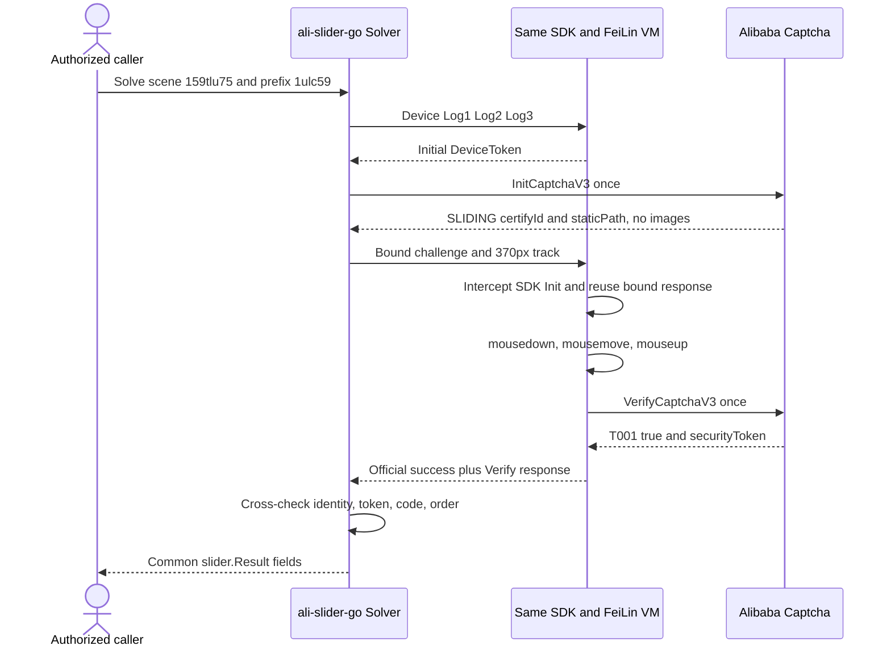

# DJI SLIDING 拖动验证码适配报告

> 后续性能优化已让 `Date/performance/event.timeStamp` 同步推进逻辑轨迹，回放循环不使用真实 timer/macrotask；无 Node 的 Linux ARM64 生产 V8 单挑战已通过。本报告中的 `5.58s` 保留为适配期历史快照，新数据与限制见 [TRACELESS / SLIDING 运行时性能优化报告](./2026-08-11_js-web-captcha-runtime-performance-report.md)。

> 风险提示：本报告只覆盖用户明确授权的 DJI 登录页验证码观察、阿里验证码公开组件单次探针和本地项目兼容修复。全过程未输入或提交 DJI 账号、手机号、短信验证码、Cookie 或登录请求，未调用 DJI 短信接口，也未保存 `CertifyId`、DeviceToken、`securityToken` 或 `captchaVerifyParam` 原值。

| 项目 | 值 |
|---|---|
| 日期 | 2026-08-11（Asia/Shanghai） |
| 目标页面 | `https://account.dji.com/login` |
| 参数 | `SceneId=159tlu75`、`prefix=1ulc59` |
| 本地项目 | `ali-slider-go` |
| 基线 | `main`，提交 `854098b`；本报告对应其上的未提交工作树 |
| 结论 | 基线会把无图 `SLIDING` 误判为 Puzzle；修复后可自动识别并完成官方拖动组件，受控 smoke 返回 `T001 / true` |
| DJI 业务提交 | 未执行 |

## 1. Executive Summary

DJI 登录页使用阿里验证码 2.0 的 `SLIDING` 类型。页面渲染 `向右滑动验证`，组件主体实测约 `416×48`；官方配置默认宽高为 `418×48`。Init 响应不包含 `Image` 或 `PuzzleImage`，因此它不是双图 Puzzle。

基线只把 `TRACELESS` 视为无图类型：RPC 会拒绝 `SLIDING` 的空图片；即使单独放宽图片校验，Solver 仍会误入资产下载、视觉识别和 Puzzle PE。修复在 Init 后按 `CaptchaType` 自动分流，新增独立 `SLIDING` 运行阶段，并在同一 SDK/FeiLin VM 中渲染官方组件、回放拖动事件、接收 SDK 内部唯一 Verify。Go 再把官方 success Base64 与 Verify 响应的场景、挑战 ID、token、结果码和布尔结果交叉校验。

使用用户给出的参数做一次显式在线组件 smoke，脱敏结果为：

```text
SLIDING completed: code=T001 result=true requests=7
PASS
```

这证明当前参数的阿里组件合同在本工作树可以完成，不证明 DJI 登录或短信业务成功，也不构成成功率、P95/P99、容量或长期稳定性结论。

## 2. Scope Summary

### 2.1 授权与边界

授权来源是用户在当前任务中的明确指令：接管已打开的 DJI 登录页，确认拖动类型，修复自动识别，并使用给定 `SceneId` 和实例域名前缀验证。

| 范围项 | 内容 |
|---|---|
| `authorization` | 当前任务中的用户明确授权 |
| `in_scope` | 当前 DJI 登录页验证码 DOM/脚本；阿里公开 SDK、Device、Init/Verify、动态资源和采集端点；当前 `ali-slider-go` 工作区 |
| `out_of_scope` | 提交 DJI 登录、发送短信、提交短信验证码、读取或保存用户会话秘密、批量挑战、成功率或性能压测 |
| `network_profile` | 页面验证码单次拖动；开发期按 first divergence 串行执行少量单挑战探针，最终快照再执行一次显式 smoke；无批量、并发或应用层重试 |
| `data_policy` | 只保留场景、prefix、类型、结果码、布尔结果、请求数量、DOM 状态和代码位置；挑战级秘密不落报告 |
| `scope_ref` | 本节为嵌入式 scope；任务规划保存在工作区外的隔离 `.planning` 目录 |

### 2.2 验收标准

1. 页面与 SDK 证据确认真实类型、交互形态和 success 输出合同。
2. 程序根据 Init 的 `CaptchaType=SLIDING` 自动分流，不要求调用方指定类型。
3. `SLIDING` 不进入双图、视觉或 Puzzle PE。
4. 同一设备会话只产生一次真实 Init 和一次真实 Verify；身份、token、请求序列和 success 数据由 Go 严格复核。
5. Puzzle 与 TRACELESS 既有行为和公共结果格式不变。
6. 离线全量、race、vet、格式、online-tag 编译和 diff 门禁通过；不调用 DJI 登录或短信接口。

## 3. Evidence Registry

| ID | 类型 | Source / command | 观察结果 | 复现与完整性说明 |
|---|---|---|---|---|
| E-001 | 页面 DOM | 用户已打开的 `account.dji.com/login` | 初态文本 `向右滑动验证`；DOM 包含 `#aliyunCaptcha-sliding-body`、`#aliyunCaptcha-sliding-slider`、`#aliyunCaptcha-sliding-left`；主体约 `416×48` | 在授权浏览器中只操作验证码；页面会更新，未保存账号、Cookie 或 HTML 全文 |
| E-002 | 页面交互 | 验证码范围内单次拖动 | 末态文本 `验证通过!`；进度约 `416px`；拖块 `left=368px` 后隐藏 | 未提交登录或短信；CDP Network 启用晚于初始请求，空缓冲不用于推断是否存在 Verify |
| E-003 | 官方运行脚本 | 页面已加载的 AliyunCaptcha、dynamicJS 和 DJI 组件 bundle | SDK 把 `TRACELESS`、`SLIDING`、`CHECK_BOX` 都列为无双图类型；SLIDING 有独立 DOM/构造器；DJI success 只接受长度大于 140 的字符串 | 瞬时 CDP 源码证据；未持久化第三方源码副本，避免把页面和会话数据纳入仓库 |
| E-004 | success 合同 | dynamicJS `onBizSuccess` 与 DJI `validate` 包装 | 官方值是 Base64 编码的四字段 JSON：`certifyId`、`sceneId`、`isSign:true`、`securityToken`；DJI 以 `captchaVerifyParam` 传给业务层 | 报告只记录字段结构，不记录本轮值 |
| E-005 | 基线根因 | `internal/challenge/rpc.go`、`internal/challenge/solver.go` 的基线与当前 diff | 基线只豁免 TRACELESS 空双图；SLIDING 会先在 RPC 图片校验失败，放宽后仍会误入 `downloadAssets` | 基线提交 `854098b` 可用 `git show` 复核；当前工作树未提交 |
| E-006 | 实现合同 | `internal/challenge/solver.go`、`internal/pe/device_runtime.go`、`internal/pe/runtime/sdk_device_bridge.mjs` | 自动类型分流；`418/48` 组件合同；`370px` 轨迹；SDK 内部唯一 Verify；success/Verify 双重校验；公开结果不新增预拼接字段 | Go stage 拒绝缺失、重复、乱序、身份/token/结果错配；String/GoString 脱敏 |
| E-007 | 受控在线 smoke | 见 3.1 命令 | 最终快照：`SLIDING completed: code=T001 result=true requests=7`；用例约 `5.58s` | 只访问阿里公开端点；当前快照单样本；日志不含挑战级秘密 |
| E-008 | 离线质量门禁 | `node --check`、`go test ./...`、`go test -race ./...`、`go vet ./...`、online-tag 编译、`git diff --check` | 全部退出码 0 | `go1.26.5 darwin/arm64`、Node `v24.14.1` |

E-001 至 E-004 是瞬时页面证据，没有原始 artifact 或哈希；这是避免持久化第三方页面、用户会话和挑战秘密的有意边界。E-005 至 E-008 可由本地源码、Git 基线和命令复核。发布前应由正式 commit 与 CI 固化源码和产物哈希。

### 3.1 在线命令

该命令会创建并验证一个真实阿里验证码挑战，只能在明确授权环境手工执行；普通测试和 CI 不会运行：

```bash
env \
  ALI_SLIDER_NODE_SLIDING_ONLINE=1 \
  ALI_SLIDER_ONLINE_SCENE_ID=159tlu75 \
  ALI_SLIDER_ONLINE_PREFIX=1ulc59 \
  go test -timeout 35s -tags=online ./internal/pe \
  -run 'TestOnlineNodeSlidingRuntime$' -count=1 -v
```

脱敏输出：

```text
=== RUN   TestOnlineNodeSlidingRuntime
device_runtime_online_test.go:229: SLIDING completed: code=T001 result=true requests=7
--- PASS: TestOnlineNodeSlidingRuntime (5.58s)
PASS
```

## 4. Findings

| ID | 状态 | 结论 | Severity | Evidence | Path |
|---|---|---|---|---|---|
| F-001 | validated | 基线不支持无图 SLIDING：RPC 拒绝空双图，Solver 也没有 SLIDING 分流 | n/a_re | E-003、E-005 | P-001 |
| F-002 | validated | DJI 当前验证码是独立 SLIDING 类型，不是 Puzzle 或 TRACELESS；官方 success 是四字段 Base64 字符串 | n/a_re | E-001、E-003、E-004 | P-002 |
| F-003 | validated | 修复能自动识别 SLIDING，在同一 SDK/FeiLin 会话完成拖动并严格验收唯一 Verify；受控组件 smoke 返回 `T001 / true` | n/a_re | E-006、E-007、E-008 | P-003 |
| F-004 | partial | 生产 V8 completion 已接线且离线合同通过；本机缺少可加载的 Darwin V8 wrapper，本轮在线执行使用同源 Node bridge | n/a_re | E-006、E-008 | P-003 |

### 4.1 F-001：原失败点

SLIDING 的 Init 合同是“有 `StaticPath`、无 `Image/PuzzleImage`”。原 RPC 把双图视为除 TRACELESS 外所有类型的必填字段，因此在 Solver 分流前已失败。仅放宽双图仍不够：原 Solver 会把未知类型送入 `downloadAssets → vision → Puzzle PE`，所以协议入口和编排必须同时修复。

### 4.2 F-002：官方输出格式

官方 SDK success 回调值等价于：

```text
Base64(JSON.stringify({certifyId, sceneId, isSign: true, securityToken}))
```

DJI 组件把该字符串放入 `captchaVerifyParam`。本项目继续沿用既有公共 API：内部解析并交叉校验官方字符串，对外只返回 `certifyId`、`sceneId`、`securityToken`、`VerifyCode` 和 `VerifyResult`；不预拼接 `captcha_verify_param`，由调用方按业务合同自行处理。

### 4.3 F-003：修复边界

- RPC 只对 `TRACELESS`/`SLIDING` 放宽空双图；其他类型继续严格校验资产路径。
- Solver 在 Init 后大小写不敏感识别 `SLIDING`，跳过资产、视觉、Puzzle PE 和 Go `RPCClient.Verify`。
- 组件默认宽度 `418px`、手柄 `48px`、目标位移 `370px`；轨迹来自既有有界 `track.LoadDefault`。
- bridge 把内部 touch 轨迹映射为 DJI 桌面组件实测的 `mousedown/mousemove/mouseup`，并补齐官方脚本实际依赖的最小 DOM/CSS/event 语义。
- SDK 的 Init 调用由 bridge 返回已绑定挑战，不发第二次真实 Init；拖动完成后首个 `VerifyCaptchaV3` 在发送前不可逆消耗机会，重复请求在 bridge 内被阻断，不访问网络。
- Go 验收 `Log1 → Log2 → Log3` 前缀、唯一 Init/Verify 及顺序，并交叉比对 success Base64 和 Verify 响应。
- `SlidingResult.String/GoString` 固定脱敏；bridge 仅返回白名单错误码，不暴露第三方栈、DOM 末态或 token。

### 4.4 F-004：未验证边界

生产 `slider.Client` 通过同进程 V8 bundle 调用同一 bridge。本机没有可加载的 Darwin V8 wrapper，因此在线 smoke 使用 Node 测试宿主；V8 stage 分流、Go completion 和严格 stage 验收由离线测试覆盖。发布环境仍应使用正式 wrapper 再跑一次受控 V8 在线 smoke，才能把该项升级为 validated。

## 5. Path Analysis

### P-001：基线失败路径

```text
Alibaba Init returns SLIDING without Image/PuzzleImage
  -> RPCClient.Init validates empty asset paths
  -> ProtocolError before type routing
  -> no component interaction and no Verify
```

### P-002：DJI 页面业务路径

```text
DJI renders AliyunCaptcha in embed mode
  -> user or automation drags the handle
  -> SDK Verify succeeds
  -> SDK emits official Base64 captchaVerifyParam
  -> DJI validate event receives the string
  -> login or SMS submission would be the caller's next step
```

最后一步不在本轮范围内，也未执行。

### P-003：修复后的求解路径



该 Mermaid 源保存在本报告和隔离规划目录的 `dji-sliding-flow.mmd`。已调用 diagram-generator 的渲染脚本验证渲染入口；本机没有 `mmdc`，脚本明确返回缺少 Mermaid CLI，因此未生成或声称存在 SVG，也没有为此全局安装依赖。

## 6. Implementation Map

| 层 | 主要文件 | 改动 |
|---|---|---|
| Captcha RPC | `internal/challenge/rpc.go` | 增加 SDK 驱动类型集合；SLIDING 允许无双图 |
| 编排 | `internal/challenge/solver.go` | Init 后自动分流 SLIDING；生成 `370px` 轨迹；返回公共结果 |
| SDK bridge | `internal/pe/runtime/sdk_device_bridge.mjs` | SLIDING worker schema、组件 DOM/CSS/event shim、鼠标拖动、唯一 Verify、官方 success 和脱敏错误 |
| Device runtime | `internal/pe/device_runtime.go` | `SlidingInput/Result`、Node/V8 completion、轨迹与 stage 严格校验 |
| V8 接线 | `internal/pe/v8_bundle.go`、`internal/pe/v8_runtime.go` | `sliding` completion stage 与 V8 返回解码 |
| 测试 | `internal/challenge/*_test.go`、`internal/pe/*_test.go` | 自动分流、空图、DOM/event、唯一 Verify、错配拒绝、在线 guard 与单次 smoke |

## 7. Consumer Contract

调用方不传验证码类型；类型由 Init 自动识别：

```go
result, err := client.Solve(ctx, slider.Request{
    SceneID: "159tlu75",
    Prefix:  "1ulc59",
})
if err != nil {
    return err
}
// result 含本轮 CertifyID、SceneID、SecurityToken、VerifyCode、VerifyResult。
// 不要记录敏感字段；captcha_verify_param 由调用方按业务合同组装。
```

HTTP 返回格式与 Puzzle/TRACELESS 一致：

```json
{
  "securityToken": "<redacted>",
  "VerifyCode": "T001",
  "VerifyResult": true,
  "certifyId": "<redacted>",
  "sceneId": "159tlu75"
}
```

## 8. Verification

最终门禁：

```bash
node --check internal/pe/runtime/sdk_device_bridge.mjs
test -z "$(gofmt -l .)"
go vet ./...
go test -count=1 ./...
go test -race -count=1 ./...
go test -count=1 -tags=online -run '^$' ./...
git diff --check
```

专项合同：

- `TestRPCInitAcceptsImageLessSDKTypes`
- `TestSolverRoutesImageLessSlidingThroughDeviceSession`
- `TestNodeSDKBridgeTracelessContracts`
- `TestNodeSDKBridgeSlidingInteractionContract`
- `TestDeviceRuntimeAcceptsBoundSlidingStage`
- `TestDeviceRuntimeRejectsMismatchedSlidingStages`
- `TestOpenDeviceKeepsOneProcessThroughSlidingCompletion`
- `TestOnlineNodeSlidingRuntime`（仅显式环境变量启用）

## 9. Timeline

本轮没有为每个浏览器动作保留精确墙钟时间；以下使用可审计的逻辑顺序，不事后补造时间。

| 顺序 | 日期 | 事件 | Evidence |
|---|---|---|---|
| T0 | 2026-08-11 | 认领用户已打开的 DJI 标签页，只读验证码 DOM 和脚本 | E-001、E-003 |
| T1 | 2026-08-11 | 验证码范围内单次拖动进入 `验证通过!`，未提交登录或短信 | E-002 |
| T2 | 2026-08-11 | 恢复无图类型、SLIDING DOM/构造器及 DJI success 字符串合同 | E-003、E-004 |
| T3 | 2026-08-11 | 审计本地 RPC/Solver，确认空图校验和 Puzzle 误路由根因 | E-005 |
| T4 | 2026-08-11 | 添加自动分流、SDK 拖动、Node/V8 completion 和严格 Go stage | E-006 |
| T5 | 2026-08-11 | online first divergence 依次定位 Init token 假设、CSS style、事件坐标/冒泡、SDK Verify 和 `insertAdjacentHTML` | E-006、E-007 |
| T6 | 2026-08-11 | 干净脱敏单次 smoke 得到 `T001 / true / requests=7` | E-007 |
| T7 | 2026-08-11 | 全量、race、vet、格式、online-tag 编译和 diff 门禁通过 | E-008 |

## 10. Remaining Limitations

1. 未提交 DJI 登录、未发送短信；页面末端业务只做静态/运行时合同取证。
2. 最终代码快照的在线 smoke 只有一个受控成功样本；开发期串行 first-divergence 探针不能并入统计，因此不能计算成功率或 P50/P95/P99，也不能证明长期稳定性。
3. 本机只做 Node 在线与 V8 离线合同；正式发布环境仍需带对应平台 wrapper 的 V8 在线 smoke。
4. 第三方页面、SDK、动态脚本、`SceneId`、prefix 和 DOM 会变化；变化后应先重新取证，不能盲目放宽白名单或解析器。
5. 当前工作树未提交；发布证据必须关联正式 commit、CI 结果和目标平台 wrapper 哈希。

## 11. Evidence → Finding → Path Traceability

| Finding | Evidence | Path | 状态 |
|---|---|---|---|
| F-001 | E-003、E-005 | P-001 | validated |
| F-002 | E-001、E-003、E-004 | P-002 | validated |
| F-003 | E-006、E-007、E-008 | P-003 | validated |
| F-004 | E-006、E-008 | P-003 | partial；等待目标平台 V8 在线证据 |

最终结论：当前项目基线不支持 DJI 使用的阿里 `SLIDING` 无图拖动类型；本工作树已补齐自动识别与官方组件执行路径，给定参数的阿里公开组件单次在线验证通过。DJI 登录和短信不在本轮执行范围内。
