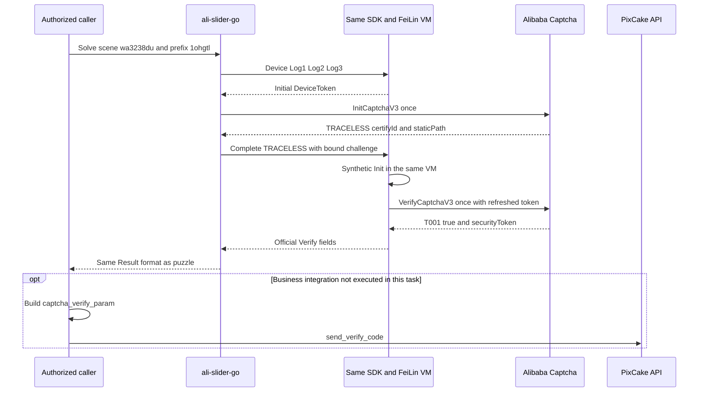

# PixCake TRACELESS 无痕验证码适配报告

> 后续性能优化已显式关闭官方 success 延迟，并在无 Node 的 Linux ARM64 生产 V8 中完成单挑战验证；本报告中的适配期单次结果保留为历史快照。新数据与限制见 [TRACELESS / SLIDING 运行时性能优化报告](./2026-08-11_js-web-captcha-runtime-performance-report.md)。

> 风险提示：本报告只覆盖用户明确授权的 PixCake 页面观察、阿里验证码公开组件探针和本地项目兼容修复。全过程未提交手机号、短信验证码、Cookie 或站点登录请求，未调用 PixCake 短信接口，也未保存 `CertifyId`、DeviceToken、`securityToken` 或业务提交参数原值。

| 项目 | 值 |
|---|---|
| 日期 | 2026-08-11（Asia/Shanghai） |
| 目标页面 | `https://www.pixcakeai.com/` |
| 本地项目 | `ali-slider-go` |
| 基线提交 | `6162a9a`；本报告对应其上的未提交工作树 |
| 结论 | 原实现不支持真正无图 `TRACELESS`；修复后显式在线组件 smoke 返回 `T001 / true` |
| 业务短信 | 未发送；业务接口未调用 |

> 后续说明：本报告记录 TRACELESS 适配当时的代码快照。当前代码又增加了无图 `SLIDING` 支持，因此“仅 TRACELESS 允许空双图”等表述只描述该历史快照；当前边界见 [DJI SLIDING 适配报告](./2026-08-11_js-web-dji-sliding-report.md)。

## 1. Executive Summary

PixCake 的手机验证码流程使用阿里验证码 2.0。第一方业务脚本配置为 `SceneId=wa3238du`、`prefix=1ohgtl`、`mode=popup`，服务端返回错误码 45 后才启动隐藏验证码；SDK 成功参数会作为 `captcha_verify_param` 重试短信接口。

真实 Init 探针返回 `CaptchaType=TRACELESS`，同时不返回 `Image` 和 `PuzzleImage`。修复前的 `RPCClient.Init` 无条件校验两张图片，Solver 又无条件进入图片下载、视觉定位、轨迹和 Puzzle PE，因此该场景必然在 Verify 前失败。

修复采用类型分流：Puzzle 原链不变；`TRACELESS` 在原有同一 SDK/FeiLin VM 内运行官方无痕流程，绑定已签发的 `SceneId/CertifyId/StaticPath`，校验 SDK 刷新后的 DeviceToken 仍属于同一 DeviceConfig SessionID，并只允许一次真实 Verify。公共结果直接返回阿里 Verify 的滑块同款字段，业务端需要的 `captcha_verify_param` 由调用方自行组装。

显式在线 Node 组件 smoke 得到：

```text
TRACELESS completed: code=T001 result=true requests=7
PASS
```

该结果证明当前 PixCake 场景的阿里无痕组件链可完成；它不证明短信已发送或 PixCake 登录业务已完成。生产 `slider.Client` 使用同进程 V8 路径，本机没有可加载的 Darwin V8 wrapper，因此本轮未做生产 V8 在线端到端验证。

## 2. Scope Summary

### 2.1 授权与范围

授权来源是用户在当前任务中的明确指令：检查已打开的 PixCake 页面、判断当前项目是否支持，并在不支持时修复；同时明确允许接管当前浏览器。

| 范围项 | 内容 |
|---|---|
| `authorization` | 当前任务中的用户明确授权 |
| `in_scope` | PixCake 登录弹窗和第一方业务脚本；阿里验证码公开 SDK、Device、Init/Verify 和动态资源；当前 `ali-slider-go` 工作区 |
| `out_of_scope` | 发送短信、提交短信验证码、登录账号、读取或保存用户会话秘密、扩大到其他站点、批量挑战或成功率压测 |
| `network_profile` | 页面只读取证；阿里 SDK 临时单实例探针；本地实现显式在线单次 smoke；无应用层重试 |
| `data_policy` | 只保留场景、类型、结果码、布尔结果、请求数量和代码位置；所有挑战级秘密不落报告 |
| `scope_ref` | 本节为嵌入式 scope；本任务未初始化独立 case 目录 |

### 2.2 验收标准

1. 能用页面/SDK证据确认 PixCake 的实际验证码类型和业务回传字段。
2. 原 Puzzle 场景行为不退化。
3. `TRACELESS` 不进入图片、视觉、轨迹或 Puzzle PE。
4. 同一设备会话内只完成一次 Init/Verify，结果身份和敏感参数经 Go 严格复核。
5. 全量单测、race、vet、格式、在线 build-tag 编译和 diff 检查通过。
6. 不调用 PixCake 短信接口。

## 3. Evidence Registry

| ID | 类型 | Source / command | 观察结果 | 复现与完整性说明 |
|---|---|---|---|---|
| E-001 | 页面 DOM 与第一方 bundle | `https://www.pixcakeai.com/`、当前 bundle `/os/DBhwtUSo.js` | 隐藏 0×0 容器/按钮；`SceneId=wa3238du`、`prefix=1ohgtl`、`mode=popup`；错误 45 后启动验证码；成功值写入 `captcha_verify_param`，最多 3 次业务重试 | 在线页面会更新，需在授权浏览器 DevTools 中按 `captcha_verify_param`、`wa3238du` 搜索；未保存页面正文或会话数据 |
| E-002 | 阿里 SDK/CDP 临时探针 | 页面已加载的 `AliyunCaptcha.js` | Init：`Success=true`、`Code=Success`、`CaptchaType=TRACELESS`，无双图；SDK 自动 Verify：`T001 / true`；success 参数为非空 opaque 字符串 | 临时实例和 DOM 在同一探针调用内销毁；未输出参数原值；未调用 PixCake API |
| E-003 | 修复前根因 | `git diff -- internal/challenge/rpc.go internal/challenge/solver.go` | 基线对 Image/PuzzleImage 无条件校验，Solver 无条件进入双图/vision/PE；当前 diff 显示类型分流 | 基线提交 `6162a9a` 可用 `git show` 复核；当前工作树 diff 未提交，不能当作发布 commit 哈希 |
| E-004 | 实现合同 | `internal/pe/runtime/sdk_device_bridge.mjs`、`internal/pe/device_runtime.go`、`internal/challenge/solver.go` | 同一 VM 合成一次已绑定 Init，真实 Verify，刷新 token 同 SessionID 校验；Solver 跳过 Puzzle 分支 | 单次 completion、stage、场景、挑战 ID、请求序列和业务参数均由 Go 复核 |
| E-005 | 显式在线 smoke | 见下方命令 | `code=T001 result=true requests=7`，包 PASS，约 1.86 秒 | 只访问阿里公开端点；日志不含挑战级秘密；单样本不能外推成功率或延迟分位数 |
| E-006 | 离线质量门禁 | `go test -count=1 ./...`、`go test -race -count=1 ./...`、`go vet ./...` | 全部 13 个 Go package 通过；vet 无输出 | 运行环境：`go1.26.5 darwin/arm64` |
| E-007 | 构建与格式门禁 | `node --check ...`、`gofmt -l .`、`go test -tags=online -run '^$' ./...`、`git diff --check` | 全部退出码 0 | Node `v24.14.1`；在线 tag 命令只编译且不执行在线用例 |
| E-008 | 公共 API 与脱敏 | `pkg/slider/types.go`、`internal/server/openapi.go`、`internal/server/web/test.html` | TRACELESS 与 Puzzle 使用相同 Verify 字段；不暴露预拼接业务参数；测试页默认遮罩 token/挑战 ID | `internal/server`、`pkg/slider` 回归覆盖字段映射、OpenAPI 和日志/格式化脱敏 |

E-001/E-002 是瞬时在线证据，没有原始 artifact 或哈希；这是为避免持久化用户页面与挑战秘密。E-003 至 E-008 以本地源码、命令和测试输出为证据。发布前应由正式 commit 固化源码哈希。

### 3.1 在线命令

```bash
env \
  ALI_SLIDER_NODE_TRACELESS_ONLINE=1 \
  ALI_SLIDER_ONLINE_SCENE_ID=wa3238du \
  ALI_SLIDER_ONLINE_PREFIX=1ohgtl \
  go test -tags=online ./internal/pe \
  -run 'TestOnlineNodeTracelessRuntime$' -count=1 -v
```

脱敏输出：

```text
=== RUN   TestOnlineNodeTracelessRuntime
device_runtime_online_test.go:167: TRACELESS completed: code=T001 result=true requests=7
--- PASS: TestOnlineNodeTracelessRuntime (1.86s)
PASS
```

## 4. Findings

| ID | 状态 | 结论 | Severity | Evidence | Path |
|---|---|---|---|---|---|
| F-001 | validated | 基线实现不支持 PixCake 的真正无图 TRACELESS：Init 空图片被拒绝，即使放宽也会继续误入 Puzzle 专用视觉/轨迹链 | n/a_re | E-002、E-003 | P-001 |
| F-002 | validated | PixCake 业务链最终提交 `captcha_verify_param`；调用方可用本轮官方 Verify 字段自行组装，服务无需预拼接 | n/a_re | E-001、E-002 | P-002 |
| F-003 | validated | 当前修复能在同一 SDK/FeiLin 会话完成 TRACELESS，严格校验刷新 token、身份、请求序列、SDK success 数据与官方 Verify 响应一致，在线组件返回 `T001 / true` | n/a_re | E-004、E-005、E-006 | P-003 |
| F-004 | partial | 生产 V8 代码路径已接线并有离线合同，但本机缺 Darwin V8 wrapper，尚无本轮生产 V8 在线证据 | n/a_re | E-004、E-006、E-007 | P-003 |

### 4.1 F-001：原实现不支持

`TRACELESS` 的协议形态不是“隐藏显示的普通滑块”，而是 Init 无图、SDK 在设备上下文内自动完成 Verify。原 `RPCClient.Init` 把双图当成所有类型的必填字段；原 Solver 又把所有挑战当成 Puzzle。根因同时存在于协议入口和编排状态机，单独放宽图片校验不构成修复。

### 4.2 F-002：业务需要完整 opaque 参数

PixCake 的短信请求字段名是 `captcha_verify_param`，其业务对象由 `sceneId`、`certifyId`、`isSign` 和 `securityToken` 组成。修复不在公共 API 中预拼接该对象：bridge 读取阿里 `VerifyCaptchaV3.Result`，Go 再将其与 SDK success 数据交叉校验，公共结果只返回滑块已有字段。

### 4.3 F-003：修复边界

- 只对大小写不敏感的 `TRACELESS` 允许空 `Image/PuzzleImage`；`StaticPath` 继续必填，非 TRACELESS 仍严格要求双图。
- TRACELESS 分支不下载图片、不调用 vision、不生成轨迹、不解析 Puzzle PE，也不调用 Go `RPCClient.Verify`。
- 官方 SDK 在同一 VM 中执行；已签发挑战通过一次性合成 Init 响应注入，避免同一 Solve 再创建真实挑战。
- SDK 刷新的 DeviceToken 不要求字节等同初始 token，但必须解密成功、校验 checksum，并绑定同一 DeviceConfig SessionID。
- 动态资源只允许 `g.alicdn.com`、`x.alicdn.com` 和 `*.aliyuncs.com` 的 HTTPS 默认端口；脚本/CSS 单项上限 2 MiB，重定向逐跳复核。
- success 参数、场景、挑战 ID、签名位、请求数量与 `Log1 → Log2 → Log3 → Init → Verify` 顺序由 Go 复核。

### 4.4 F-004：未验证边界

本机已有 native 库是 Linux ARM64 ELF，macOS 无 Cargo 和可加载 `.dylib`，Docker daemon 也未连接。本轮没有全局安装工具、启动 Docker 或替换运行时。因此实际在线执行使用与生产 V8 bundle 同源的 Node bridge；`v8_bundle.go`、V8 completion 分流和 host 白名单已通过离线测试/编译，但仍需在正式 Linux/macOS V8 发布环境跑一次受控在线 smoke 才能把 F-004 升为 validated。

## 5. Path Analysis

### P-001：基线失败路径

```text
PixCake TRACELESS Init（无 Image/PuzzleImage）
  → RPCClient.Init 无条件 ValidateAssetPath("")
  → ProtocolError
  → Solver 在 Verify 前结束
```

### P-002：PixCake 业务路径

```text
首次 send_verify_code
  → PixCake 错误 45 / CaptchaVerificationRequired
  → 隐藏按钮启动 AliyunCaptcha popup 实例
  → SDK 完成验证
  → send_verify_code 增加 captcha_verify_param 后重试
```

最后一步属于业务接入，本轮未执行。

### P-003：修复后的本地求解路径



可编辑 Mermaid 源同时保存在任务规划目录。已按 diagram-generator 渲染流程调用官方脚本；本机缺少 `mmdc`，因此没有声称生成 SVG，也没有为此全局安装依赖。

## 6. Implementation Map

| 层 | 主要文件 | 改动 |
|---|---|---|
| 协议 | `internal/protocol/params.go` | 严格解析 SDK business success 参数 |
| Captcha RPC | `internal/challenge/rpc.go` | 只为 TRACELESS 放宽空双图；其他类型不变 |
| 编排 | `internal/challenge/solver.go` | Init 后按类型分流；TRACELESS 跳过 Puzzle 链 |
| SDK bridge | `internal/pe/runtime/sdk_device_bridge.mjs` | 临时 DOM/button、一次性合成 Init、官方 Verify、stage 输出、资源白名单和错误脱敏 |
| Device runtime | `internal/pe/device_runtime.go` | Node/V8 共用 `SolveTraceless`，严格身份/token/序列/参数复核 |
| V8 接线 | `internal/pe/v8_bundle.go`、`v8_runtime.go`、`v8_host.go` | completion stage 分流与精确 `x.alicdn.com` 访问边界 |
| 公共结果 | `pkg/slider/types.go`、`client.go` | TRACELESS 复用现有滑块 Result，不新增预拼接业务字段 |
| HTTP/页面 | `internal/server/openapi.go`、`internal/server/web/test.html` | OpenAPI 可选字段；页面默认遮罩 |
| 测试 | `internal/pe/sdk_device_bridge_test.go` 等 | DOM、白名单、stage、solver 分流、OpenAPI、脱敏和在线 guard 回归 |

## 7. Consumer Contract

Go 调用方：

```go
result, err := client.Solve(ctx, slider.Request{
    SceneID: "wa3238du",
    Prefix:  "1ohgtl",
})
if err != nil {
    return err
}
// result.CertifyID、result.SceneID、result.SecurityToken 来自本轮官方结果；
// 调用方自行组装 captcha_verify_param，禁止日志记录。
```

HTTP TRACELESS 与 Puzzle 返回同一格式：

```json
{
  "securityToken": "<redacted>",
  "VerifyCode": "T001",
  "VerifyResult": true,
  "certifyId": "<redacted>",
  "sceneId": "wa3238du"
}
```

服务不输出 `captchaVerifyParam`。调用方可按业务合同自行组装 `{certifyId, sceneId, isSign: true, securityToken}`；不要把结果或 token 写入日志。

## 8. Verification

最终本地门禁：

```bash
node --check internal/pe/runtime/sdk_device_bridge.mjs
test -z "$(gofmt -l .)"
go vet ./...
go test -count=1 ./...
go test -race -count=1 ./...
go test -count=1 -tags=online -run '^$' ./...
git diff --check
```

结果：全部退出码 0；`go test` 与 `go test -race` 均显示 13 个 package 通过。`staticcheck` 在当前机器不在 PATH，本报告不声称本地执行过；仓库 CI 仍固定运行它。

专项离线合同包括：

- `TestRPCInitAcceptsImageLessSDKTypes`
- `TestSolverRoutesImageLessTracelessThroughDeviceSession`
- `TestNodeSDKBridgeTracelessContracts`
- `TestDeviceRuntimeAcceptsBoundTracelessStage`
- `TestDeviceRuntimeRejectsMismatchedTracelessStages`
- `TestOpenDeviceKeepsOneProcessThroughTracelessCompletion`
- OpenAPI 可选字段和公共 Result 脱敏/映射回归

## 9. Timeline

本轮没有为浏览器每个动作保留墙钟时间；以下使用可审计的逻辑顺序，避免事后伪造精确时间。

| 顺序 | 日期 | 事件 | Evidence |
|---|---|---|---|
| T0 | 2026-08-11 | 认领用户已打开的 PixCake 标签页，只读登录弹窗、DOM 和脚本 | E-001 |
| T1 | 2026-08-11 | 从业务 bundle 恢复错误 45、隐藏验证码和 `captcha_verify_param` 重试链 | E-001 |
| T2 | 2026-08-11 | 临时 SDK 探针确认 `TRACELESS`、无双图、自动 Verify `T001 / true`；清理实例 | E-002 |
| T3 | 2026-08-11 | 审计本地 RPC/Solver，确认无条件双图和 Puzzle 链为根因 | E-003 |
| T4 | 2026-08-11 | 实现 RPC、SDK bridge、Device runtime、Solver 和公共 API 分流 | E-004、E-008 |
| T5 | 2026-08-11 | 在线首分歧依次定位 token 刷新、DOM 原型、`x.alicdn.com` 和 `NodeList` | E-004、E-005 |
| T6 | 2026-08-11 | 显式在线单次 smoke 得到 `T001 / true / requests=7` | E-005 |
| T7 | 2026-08-11 | 全量、race、vet、格式、online-tag 编译、diff 门禁通过 | E-006、E-007 |

## 10. Remaining Limitations

1. 未发送短信、未登录 PixCake；业务 API 最后一步只由 bundle 静态/运行时证据确认。
2. 在线 smoke 是一个样本，不提供成功率、P50/P95/P99 或容量结论。
3. 生产 V8 在线路径仍需在带正式 wrapper 的发布环境验证一次；本机只完成 Node 在线和 V8 离线合同。
4. 第三方页面、SDK 和动态脚本会变化；`SceneId`、`prefix`、主机与 DOM 合同变化时，应先重新取证，不能盲目放宽白名单或解析器。
5. 当前工作树未提交；发布证据必须关联正式 commit、CI 结果和目标平台 wrapper 哈希。

## 11. Evidence → Finding → Path Traceability

| Finding | Evidence | Path | 状态 |
|---|---|---|---|
| F-001 | E-002、E-003 | P-001 | validated |
| F-002 | E-001、E-002 | P-002 | validated |
| F-003 | E-004、E-005、E-006、E-008 | P-003 | validated |
| F-004 | E-004、E-006、E-007 | P-003 | partial；等待目标平台 V8 在线证据 |

最终结论：当前项目原先不支持 PixCake 的阿里 `TRACELESS` 无痕类型；本工作树已补齐兼容，阿里公开组件在线单次验证通过。业务短信和登录不在本轮执行范围内。
