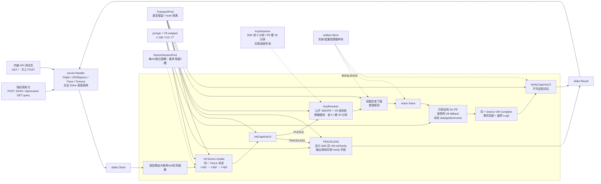
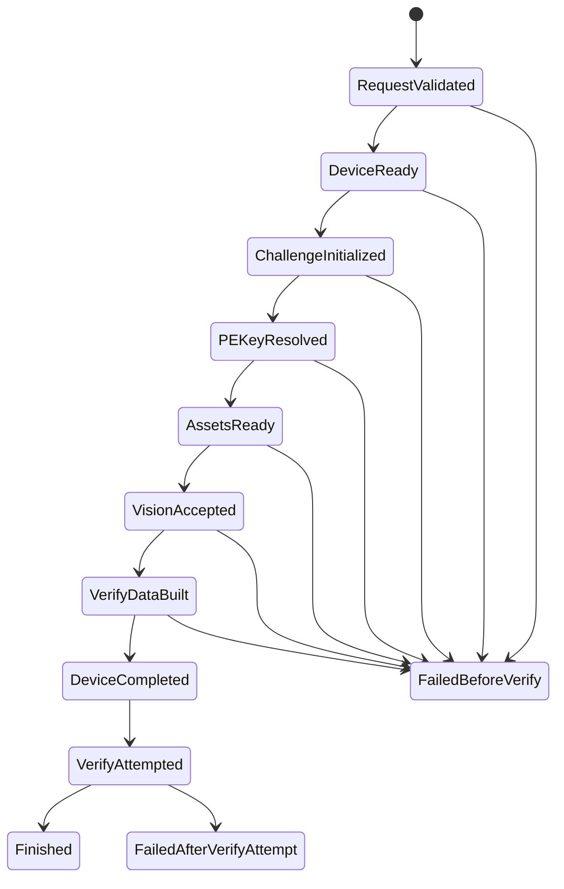

# 架构说明

## 1. 系统定位

`ali-slider-go` 是独立 Go module，提供可并发复用的 `slider.Client` 和四个 HTTP 路径：`GET /`、`GET|POST /api/slider`、`GET /health` 和 `GET /openapi.json`。生产主链不依赖 Python、Node 进程、浏览器、OpenCV、GoCV 或 CGo；Go 通过 `purego` 加载 Rust `cdylib`，在同进程 V8 `149.4.0` Isolate 中执行动态 Device SDK，并为每个精确 PE `StaticPath` 建立当前 V8 oracle。只有完整 payload、轨迹事件和时钟差分为零的分片才在 TTL 内使用纯 Go 生成单轮 `data`；差分不一致或采样失败则保留 V8 执行。公开 SDK 每 5 分钟字节复核，精确 PE 最多 30 分钟强制重采样；DeviceToken、`CertifyId`、轨迹和 `data` 始终属于单轮。`GET /` 返回编译进 EXE 的第一方浏览器测试页，不代表服务端启动浏览器。

完整单轮编排已实现：

```text
同一 V8/FeiLin Isolate：Device Log1/Log2/Log3
  → InitCaptchaV3
  ├─ TRACELESS：同一 VM 调用官方 SDK 无痕实例，绑定刷新后的 DeviceToken 并唯一 Verify
  └─ PUZZLE：精确 PE → 双图 → 视觉/轨迹 → 同一 VM Complete → 唯一 Verify
```

本地与Mock质量门槛已建立。Linux AMD64公开分片差分证明强制V8与纯Go的解包JSON、arg、全部TrackList、互动事件和延时一致；强制V8约 `530ms`，纯Go约 `0.364ms`。最终安全候选真实50次为 `47/50`、mean `2562ms`、P50 `2157ms`、P95 `4910ms`，32/32分片自校验兼容，分类错误0。默认直连公开组件A/B证明预热池最多安全保留4个Device VM。因此当前P50明显快于原 `4722ms`基线，但并发10下平均仍未达到约1秒，也未完成长时间资源稳定性结论。

Device RPC 响应按 action 解码：顶层 Code 统一校验，只有 Log1 将 `ResultObject` 解为对象并提取 `DeviceConfig`；Log2/Log3 允许非对象成功结果。该边界防止把真实上游的合法 schema 差异误归为协议失败。

## 2. 总体数据流



`TRACELESS` 的 Init 响应不含背景图或滑块图，因此不会进入资产、视觉、轨迹或动态 PE 分支。运行桥在同一 SDK/FeiLin VM 内复用已签发挑战，记录 SDK 刷新的同 session DeviceToken，只允许一次 Init 和一次 Verify；公共结果直接使用阿里 Verify 响应的 `securityToken`、`VerifyCode`、`VerifyResult` 和 `certifyId`，与图片拼图合同一致。

HTTP 层先完成浏览器跨源和输入校验；合法 `POST /api/slider` JSON 与 deprecated `GET /api/slider?...` query 都不经过本地 admission gate，直接调用 Solver，也不因本机在途请求数主动返回 `429` 或 `Retry-After`。GET 与 POST 不合并参数源，form body 不受支持。Handler 和 concrete Client 都会传播超时 context；Solver 必须尊重 context，不使用无界 goroutine 伪造“强制取消”。Client 连接池或预热池的资源预算不等于 HTTP 请求上限。

deprecated GET 并非 REST 语义上的安全读取；它只为旧 Python 客户端保留，会创建真实挑战和上游请求。Handler 使用 `checkSolveOrigin` 将 GET 的同源检查副本视为 unsafe POST，以复用 Go `CrossOriginProtection`；明确跨源 POST/GET 均在 Solver 前返回 403，同源、`Sec-Fetch-Site: none` 和无浏览器头的旧客户端则允许。

内嵌测试页不依赖外部 CDN/框架/字体，只能向同源 `/health` 和 `/api/slider` 发起 fetch。页面打开只检查 health；Solve 必须由用户显式提交，执行期间防双击，不做重试或批量压测。页面 CSP、随机 nonce、默认敏感字段遮罩和无浏览器持久化只保护本页边界，不替代 API 鉴权。

## 3. 包与层级

| 层 | 包 | 责任 |
|---|---|---|
| 进程入口 | `cmd/server` | 解析配置、先 bind 端口、构造 Client、预热、定时清理、信号关闭 |
| 公共 library | `pkg/slider` | `Client` / `Request` / `Result` / 稳定错误类别与生命周期 |
| HTTP 适配 | `internal/server` | 四路径、内嵌测试页、POST JSON/deprecated GET query、跨源边界、别名/空值解析、`MaxRequestBytes` 对 JSON body/raw query 各限 64 KiB、合法 Solve 直接调用、deadline、panic 恢复、OpenAPI、脱敏日志 |
| 单轮编排 | `internal/challenge` | Solver 状态机、Captcha RPC、资产下载、路由池、设备预热池 |
| 设备协议 | `internal/device` | 画像、纯 Go oracle/兼容会话、DeviceConfig 与交互事件合同 |
| 纯计算 | `internal/vision` | PNG 边界、多信号匹配、Chamfer 兜底、置信度 |
| 纯计算 | `internal/track` | 嵌入轨迹、缩放、稀疏化和有界人类化 |
| PE/设备运行时 | `internal/pe` | 可回收外层 V8/FeiLin 设备宿主、每轮新浏览器 context/session/token、精确分片 V8 自校验、纯 Go 快路与 V8 fallback、Data/token/getter/事件/时钟独立复核 |
| V8 FFI | `internal/v8runtime` | 无 CGo 加载 wrapper、C ABI 校验、Isolate 生命周期、可取消 eval/call 和 Go host JSON 回调 |
| 协议原语 | `internal/protocol` | AES、签名、JS/RPC 编码、DeviceToken、Data pack/unpack |
| 运行时注入 | `internal/runtimekit` | 密码学熵、UUID、时钟与可取消 Sleep |
| 证据存储 | `internal/artifact` | 只保存失败/低置信图和脱敏 metrics，保留期与硬配额 |
| 配置 | `internal/config` | defaults → env → flags → 集中校验 |

生产 `go.mod` 仅新增 `github.com/ebitengine/purego`，用于无 CGo 加载动态库；Rust wrapper 锁定 `v8=149.4.0` 和 `deno_core_icudata=0.77.0`。Python 只曾用于开发期生成脱敏 oracle fixture；Node 只保留为可选回归 oracle/上下文差异测试，不进入生产构造器、Docker 运行层或 Windows 包。

## 4. 单轮状态机与唯一 Verify



不变量：

1. 每个 Solve 创建独立 RPCClient，RPCClient 只允许一次 Init。
2. RPCClient 记录 Init 签发的 `CertifyId`；Verify 必须使用同一 ID。
3. `verifyAttempted` 在构造/HTTP 发送之前从 false 不可逆地变为 true。DNS、TLS、超时或结果未知均不回滚。
4. 动态 PE 源码/画像无法解析、低置信、图像错误、PE/getter/时钟不一致及 Device Complete 失败都在 Verify 前终止。
5. Verify 业务拒绝是完成态：返回 `200 + ok=false`，不转成交通错误，不重试。

## 5. 并发与资源所有权

| 资源 | 所有者 | 并发策略 | 释放 |
|---|---|---|---|
| HTTP 请求、trace、请求 DTO、结果 DTO | 单请求 | `net/http` 按请求调度；POST JSON 或 deprecated GET query 输入合法后直接进入 Solver，无本地 admission 槽 | 响应后 |
| Device VM Session / DeviceToken / CertifyId / Verify 位 | 单轮 | Init 与 Complete 保持同一 VM；不跨挑战复用 | Solve 返回时 close/release |
| 预热V8 Device Session | DeviceSessionPool | `ready + pending + leased <= capacity + reserve <= 4`；每slot独立画像，reserve默认0；默认最多空闲20秒 | 满池等待；Complete后回收外层Isolate，重建独立context/session/token再入池；失败则关闭并冷补货 |
| HTTP transport | TransportPool | 按规范 route 隔离；直连保留；有界 LRU；每 route/host 连接受 Client `MaxConcurrency` 预算约束，但不限制 Solve 调用数 | Client.Close 关闭空闲连接并清表 |
| 公开 SDK/PE 源码与结构画像 | KeyResolver | 完整 `StaticPath` 隔离；SDK 单飞、同路径 PE/profile 单飞、不同路径可并发；SDK 软 TTL 5 分钟、PE/profile 硬 TTL 30 分钟；不含 token/CertifyId/轨迹/data | SDK 字节变更立即清空；硬 TTL 或 Client 关闭时替换/释放 |
| PE 构造运行时 | KeyResolver / 单轮 | 新精确分片在禁网 V8 context 中采样并与纯 Go 逐字段差分；兼容后每轮纯 Go，不兼容则每轮 V8；外层 V8 runtime 和精确源码 code cache 均有界 | 单轮输入/输出阶段结束即释放；idle runtime 由 Resolver.Close 关闭 |
| 图像字节和视觉 scratch | 单轮 | 输入有字节/尺寸/像素硬边界 | 阶段结束后 GC/复用 |
| 默认轨迹 fixture | 进程 | `embed` + `sync.Once`；输出切片按请求独立 | 进程关闭 |
| artifact | Store | 同目录串行配额决策；随机 O_EXCL | 超期/配额淘汰 |

Client 的关闭顺序是：禁止新工作 → 等待活动 Solve/Prime/Purge → 关预热 Isolate → 关 V8 wrapper → 关 transport。`Close` 并发幂等。

HTTP 进程入口的 `maxHeaderBytes` 是 `server.MaxRequestBytes + 32 KiB`：64 KiB 是 Handler 对 raw query 数据的真实上限，多出的 32 KiB 只留给 request line 与普通 header。该分层避免真实 `net/http.Server` 在 Handler 之前误拒恰好达到上限的旧 query。

## 6. 超时与错误分类

- Handler 为每个通过跨源和输入校验的请求建立 `Options.Timeout` deadline，并保留调用方取消信号。
- concrete Solver 内再建立同一总时限，保护直接 library 调用。
- Device RPC 可在总 context 内使用更窄的请求超时。
- JSON/query HTTP 输入错误返回 `400` 且不调用 Solver；明确的浏览器跨源 POST/deprecated GET 返回 `403 ApiOriginError` 且不调用 Solver。Solver 参数错误返回 `400`，完成态业务结果返回 `200`，技术错误、超时或 panic 返回脱敏 `500`。两种 Solve 方法都不声明 429。
- 每个 `/api/slider` 响应保留服务端 trace，`X-Trace-ID` 与响应体 `traceId` 一致。
- `NetworkError` 只表示已标记的 DNS/TLS/HTTP/响应读取/超时失败。
- `deviceSession`、`resolvePEKey`、`buildVerifyData`、`completeDevice` 会识别 V8/公开脚本错误：下载/路由失败归 `NetworkError`，wrapper 缺失、ABI/架构错误或 V8 初始化失败归 `InternalError`，路径/脚本/schema/算法不受支持归 `ProtocolError`；都在 Verify 前停止。
- HTTP 2xx 中的 JSON/schema、签名、DeviceConfig、时钟和本地不变量失败归入 `ProtocolError`。
- 上游正文、代理口令、token 和 CertifyId 不进入错误 Message、String/GoString 或普通日志。

## 7. 性能边界

声明的验收基线是 Mac ARM64 16 核/48 GiB：

- 当前精确分片差分通过后，纯 Go `buildVerifyData` 在真实 50 次中 mean `1–2ms`，强制 V8 仍约 `530ms`；动态自校验没有被取消。
- 最终安全候选50次mean `2562ms`、P50 `2157ms`、P95 `4910ms`，后25次mean `2232ms`。阶段主瓶颈为默认直连池4槽边界下的 `deviceSession=1644ms`；不得用后半窗口冒充全批，也不得恢复同池5+会话换速度。
- 2026-08-07 历史 Client harness 使用并发 32，但没有经过 HTTP Handler；32 是历史测量参数，不是 HTTP admission 上限，也不代表当前 V8 Isolate 容量。
- 预热只是性能优化，失败不改变协议正确性；但会影响首批与尾延迟，必须在报告中单列。
- 同等 32 路 Client harness 的 RSS、GC、goroutine 峰值及长时间稳定性仍需独立报告。

详细口径、命令与已测/待测项见 [performance.md](./performance.md)。

## 8. Evidence → Finding → Path

| Evidence | Finding | Path |
|---|---|---|
| `pkg/slider/client.go` · `Client.Solve/Prime/Close` | library 拥有完整 Solver、预热与并发安全关闭生命周期。 | caller → Client → challenge.Solver → Result |
| `internal/challenge/solver.go` · `Solver.Solve` / `completeAndVerify` | 前置协议阶段通过后只有一个 Verify 调用点。 | Device → Init → Assets → Vision → PE → Complete → Verify |
| `internal/pe/keys.go`、`v8_runtime.go`、`runtime.go`、`device_runtime.go`；`native/v8runtime/src/lib.rs`；对应离线/显式在线测试 | SDK/同分片 miss 合并、异分片并发；软 5/硬 30 分钟边界；精确分片 V8 与纯 Go 完整差分；Device 外层 Isolate 回收但每轮 context/session/token 重建；V8/code cache 有界。 | StaticPath → V8 oracle → verified pure-Go or V8 fallback → one-round data/token |
| `internal/challenge/rpc.go` · `RPCClient.Init/Verify` | Init 与唯一 Verify 有实例级状态与 CertifyId 绑定。 | Init consumes attempt → issued ID → Verify consumes attempt |
| `internal/server/server.go` · `MaxRequestBytes` / `checkSolveOrigin` / `decodeQueryRequest` / `requestFromPayload` / `handleSolve` / `callSolver`；`cmd/server/main.go` · `maxHeaderBytes`；`cmd/server/main_test.go` · `TestHeaderBudgetAcceptsMaximumLegacyQuery` | HTTP 入口保留足够 request-line/header 预算，再对 POST 和 deprecated GET 拒绝明确浏览器跨源请求，分别校验 JSON body 与 query；合法请求不经过本地 admission，在请求派生的 deadline context 中调用 Solver。 | request → HTTP budget → origin + source-specific gate → timeout context → Solve → mapped response |
| `internal/server/testpage.go` · `writeTestPage`；`internal/server/web/test.html` | 第一方页面编译进二进制，以随机 nonce CSP 约束为同源手工调用且不持久化结果。 | GET `/` → embedded page → explicit POST `/api/slider` |
| `internal/config/config.go` · `MaxConcurrency` / `MaxDevicePrewarmCapacity`；`pkg/slider/client.go` · `NewClient` | `MaxConcurrency`是每route/host连接与PE预算；默认Device预热池库存另有硬上限4；两者都不是HTTP admission阈值。 | config → ClientOptions → transport/PE/device budgets；valid request → Solver |
| `internal/pe/v8_runtime_online_test.go` | Linux AMD64 公开链验证 Device Isolate recycle 后 session/token 独立，并验证当前精确 PE 的强制 V8/纯 Go payload、事件和时钟完全一致；不调用 Captcha Init/Verify。 | public SDK/PE + Device RPC → recycled outer Isolate / fresh round → V8 oracle → verified builder |
| `internal/challenge/performance_test.go`；[脱敏验证证据](./evidence/validation-2026-08-07.md) | 离线 32 路 Mock Solver 链正确性通过；200 样本纯计算 `P99=57.05075ms`。 | fixture → concurrent Solver chain / sorted compute samples → verified gates |
| `pkg/slider/online_acceptance_test.go:37`、`:49`、`:98`、`:128`、`:147`、`:165`、`:168`；[脱敏验证证据](./evidence/validation-2026-08-07.md) | 2026-08-07 的 200/32/应用层零重试候选批次严格成功 `196/200`，Client 完整链墙钟 P95 `984ms`；最终 one-shot 加固后未在线重跑。 | public Client → one Solve per job → aggregate summary → bounded Client acceptance；不经过 HTTP Handler |
| `cmd/server/main.go` · `run` | 启动先 bind，再 purge/Prime，避免端口冲突仍发外部预热。 | parse → listen → client → prime → serve |
