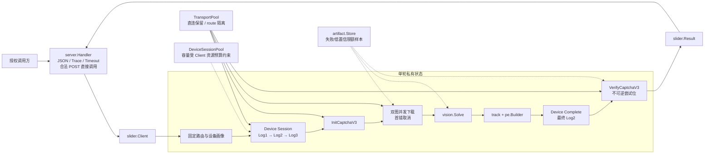
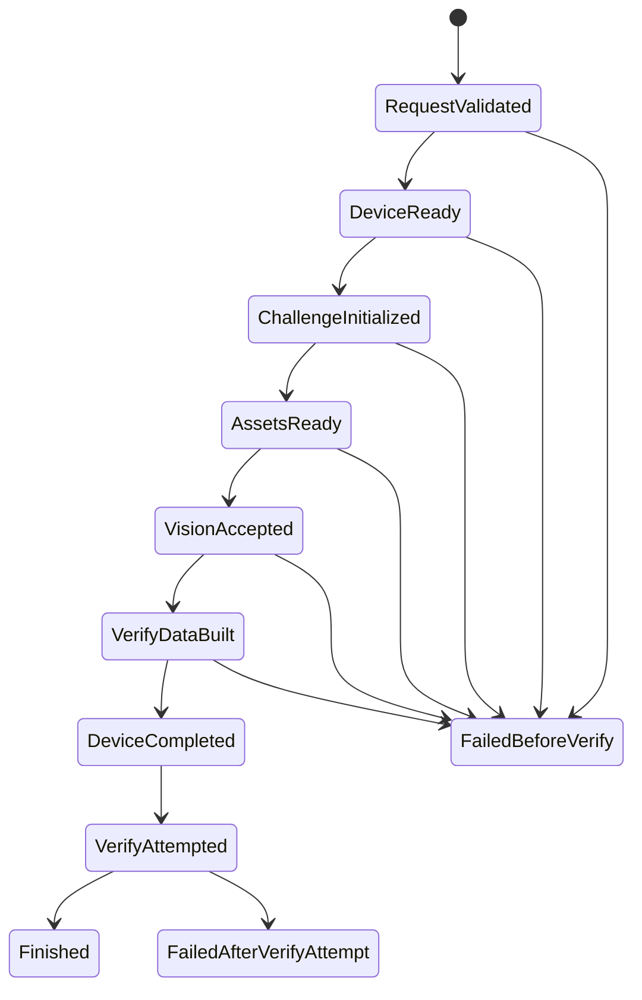

# 架构说明

## 1. 系统定位

`ali-slider-go` 是独立的纯 Go module，提供可并发复用的 `slider.Client` 和三个 HTTP 端点。生产链不启动 Python、Node.js、浏览器或子进程，不依赖 OpenCV、GoCV、CGo 或动态库。

完整单轮编排已实现：

```text
Device Log1/Log2/Log3
  → InitCaptchaV3
  → 并发下载背景图与滑块图
  → 纯 Go 视觉定位
  → 轨迹、PE/Data 与 getter 合同
  → Device 最终 Log2
  → 唯一 VerifyCaptchaV3
```

本地与 Mock 质量门槛已建立。Device Log1/2/3 在线探针约 `0.53s` 通过；2026-08-07 唯一授权候选报告恰好覆盖 200 个新挑战、并发 32、每个 job 一次 Solve、应用层零重试，严格成功 `196/200`，Client 完整链墙钟 `P95=984ms`。该批先于最终传输 one-shot 加固，最终源码未获授权再跑第二批。这些是有限批次实测，不由架构本身推导，也不证明长时间资源稳定性。

Device RPC 响应按 action 解码：顶层 Code 统一校验，只有 Log1 将 `ResultObject` 解为对象并提取 `DeviceConfig`；Log2/Log3 允许非对象成功结果。该边界防止把真实上游的合法 schema 差异误归为协议失败。

## 2. 总体数据流



HTTP 层先完成输入校验；合法 `POST /api/slider` 不经过本地 admission gate，直接调用 Solver，也不因本机在途请求数主动返回 `429` 或 `Retry-After`。Handler 和 concrete Client 都会传播超时 context；Solver 必须尊重 context，不使用无界 goroutine 伪造“强制取消”。Client 连接池或预热池的资源预算不等于 HTTP 请求上限。

## 3. 包与层级

| 层 | 包 | 责任 |
|---|---|---|
| 进程入口 | `cmd/server` | 解析配置、先 bind 端口、构造 Client、预热、定时清理、信号关闭 |
| 公共 library | `pkg/slider` | `Client` / `Request` / `Result` / 稳定错误类别与生命周期 |
| HTTP 适配 | `internal/server` | 三路由、别名解析、64 KiB 限制、合法 POST 直接调用、deadline、panic 恢复、OpenAPI、脱敏日志 |
| 单轮编排 | `internal/challenge` | Solver 状态机、Captcha RPC、资产下载、路由池、设备预热池 |
| 设备协议 | `internal/device` | 画像、111 字段、Log1/2/3、DeviceConfig、token 与最终 getter |
| 纯计算 | `internal/vision` | PNG 边界、多信号匹配、Chamfer 兜底、置信度 |
| 纯计算 | `internal/track` | 嵌入轨迹、缩放、稀疏化和有界人类化 |
| 纯计算 | `internal/pe` | 几何、互动事件、getter 计划、PE Data 打包 |
| 协议原语 | `internal/protocol` | AES、签名、JS/RPC 编码、DeviceToken、Data pack/unpack |
| 运行时注入 | `internal/runtimekit` | 密码学熵、UUID、时钟与可取消 Sleep |
| 证据存储 | `internal/artifact` | 只保存失败/低置信图和脱敏 metrics，保留期与硬配额 |
| 配置 | `internal/config` | defaults → env → flags → 集中校验 |

生产 `go.mod` 没有第三方依赖。Python 只曾用于开发期生成脱敏 oracle fixture，Go 测试不调用 Python。

## 4. 单轮状态机与唯一 Verify



不变量：

1. 每个 Solve 创建独立 RPCClient，RPCClient 只允许一次 Init。
2. RPCClient 记录 Init 签发的 `CertifyId`；Verify 必须使用同一 ID。
3. `verifyAttempted` 在构造/HTTP 发送之前从 false 不可逆地变为 true。DNS、TLS、超时或结果未知均不回滚。
4. 低置信、图像错误、PE/getter 不一致及 Device Complete 失败都在 Verify 前终止。
5. Verify 业务拒绝是完成态：返回 `200 + ok=false`，不转成交通错误，不重试。

## 5. 并发与资源所有权

| 资源 | 所有者 | 并发策略 | 释放 |
|---|---|---|---|
| HTTP 请求、trace、请求 DTO、结果 DTO | 单请求 | `net/http` 按请求调度；输入合法后直接进入 Solver，无本地 admission 槽 | 响应后 |
| Device Session / CertifyId / Verify 位 | 单轮 | 不跨挑战共享 | Solve 返回时 close/release |
| 预热 Device Session | DeviceSessionPool | `ready + pending + leased <= capacity <= MaxConcurrency`；一次性消费 | release 关闭后有界回补 |
| HTTP transport | TransportPool | 按规范 route 隔离；直连保留；有界 LRU；每 route/host 连接受 Client `MaxConcurrency` 预算约束，但不限制 Solve 调用数 | Client.Close 关闭空闲连接并清表 |
| 图像字节和视觉 scratch | 单轮 | 输入有字节/尺寸/像素硬边界 | 阶段结束后 GC/复用 |
| 默认轨迹 fixture | 进程 | `embed` + `sync.Once`；输出切片按请求独立 | 进程关闭 |
| artifact | Store | 同目录串行配额决策；随机 O_EXCL | 超期/配额淘汰 |

Client 的关闭顺序是：禁止新工作 → 等待活动 Solve/Prime/Purge → 关预热池 → 关 transport。`Close` 并发幂等。

## 6. 超时与错误分类

- Handler 为每个通过输入校验的请求建立 `Options.Timeout` deadline，并保留调用方取消信号。
- concrete Solver 内再建立同一总时限，保护直接 library 调用。
- Device RPC 可在总 context 内使用更窄的请求超时。
- HTTP 输入错误返回 `400` 且不调用 Solver；Solver 参数错误返回 `400`，完成态业务结果返回 `200`，技术错误、超时或 panic 返回脱敏 `500`。
- 每个 `/api/slider` 响应保留服务端 trace，`X-Trace-ID` 与响应体 `traceId` 一致。
- `NetworkError` 只表示已标记的 DNS/TLS/HTTP/响应读取/超时失败。
- HTTP 2xx 中的 JSON/schema、签名、DeviceConfig、时钟和本地不变量失败归入 `ProtocolError`。
- 上游正文、代理口令、token 和 CertifyId 不进入错误 Message、String/GoString 或普通日志。

## 7. 性能边界

声明的验收基线是 Mac ARM64 16 核/48 GiB：

- 纯计算 `P99<=100ms` 是硬门槛，范围为已下载图像到 Vision、Track、PE/Data 完成；Mac ARM64 200 样本结果为 `57.05075ms`，通过。
- 热态、直连、无排队的 Client 完整链 `P95<=1000ms`；候选批次为 `984ms`，通过。
- 2026-08-07 正式 Client harness 使用并发 32，但没有经过 HTTP Handler；32 是该次历史测量参数，不是 HTTP admission 上限。该批 `P99=1018ms`、`max=1555ms`，没有 P99 小于 1 秒的结论。
- 预热只是性能优化，失败不改变协议正确性；但会影响首批与尾延迟，必须在报告中单列。
- 同等 32 路 Client harness 的 RSS、GC、goroutine 峰值及长时间稳定性仍需独立报告。

详细口径、命令与已测/待测项见 [performance.md](./performance.md)。

## 8. Evidence → Finding → Path

| Evidence | Finding | Path |
|---|---|---|
| `pkg/slider/client.go` · `Client.Solve/Prime/Close` | library 拥有完整 Solver、预热与并发安全关闭生命周期。 | caller → Client → challenge.Solver → Result |
| `internal/challenge/solver.go` · `Solver.Solve` / `completeAndVerify` | 前置协议阶段通过后只有一个 Verify 调用点。 | Device → Init → Assets → Vision → PE → Complete → Verify |
| `internal/challenge/rpc.go` · `RPCClient.Init/Verify` | Init 与唯一 Verify 有实例级状态与 CertifyId 绑定。 | Init consumes attempt → issued ID → Verify consumes attempt |
| `internal/server/server.go:105` · `handleSolve`；`:135` · `callSolver` | HTTP 层先校验；合法请求不经过本地 admission，直接在请求派生的 deadline context 中调用 Solver，并在同一调用栈恢复 panic。 | request → decode → timeout context → Solve → mapped response |
| `internal/config/config.go:26` · `MaxConcurrency`；`pkg/slider/client.go:91` · `NewTransportPool`；`:122` · `NewDeviceSessionPool` | `MaxConcurrency` 是 Client 每 route/host 出站连接与预热资源预算，不是 HTTP 并发阈值。 | config → ClientOptions → transport/prewarm budget；valid POST → Solver |
| `internal/device/rpc.go:119`、`:130`；`internal/device/online_session_test.go:17` | Device schema 按 action 解码；在线 Log1/2/3 探针约 `0.53s` 通过。 | raw response → schema gate → authorized probe |
| `internal/challenge/performance_test.go`；[脱敏验证证据](./evidence/validation-2026-08-07.md) | 离线 32 路 Mock Solver 链正确性通过；200 样本纯计算 `P99=57.05075ms`。 | fixture → concurrent Solver chain / sorted compute samples → verified gates |
| `pkg/slider/online_acceptance_test.go:37`、`:49`、`:98`、`:128`、`:147`、`:165`、`:168`；[脱敏验证证据](./evidence/validation-2026-08-07.md) | 2026-08-07 的 200/32/应用层零重试候选批次严格成功 `196/200`，Client 完整链墙钟 P95 `984ms`；最终 one-shot 加固后未在线重跑。 | public Client → one Solve per job → aggregate summary → bounded Client acceptance；不经过 HTTP Handler |
| `cmd/server/main.go` · `run` | 启动先 bind，再 purge/Prime，避免端口冲突仍发外部预热。 | parse → listen → client → prime → serve |
