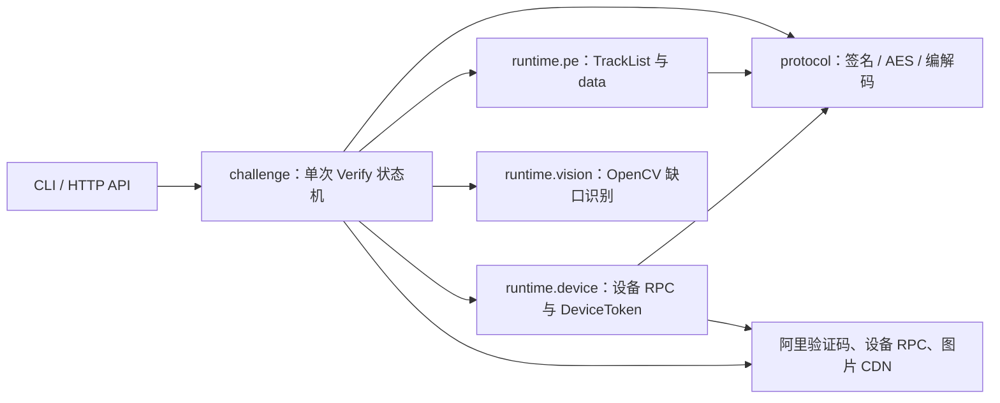

# 阿里 V3 滑块纯 Python 协议复现

> 仅用于已获得明确授权的本地研究、兼容性验证与测试环境。禁止用于批量解题、
> 并发滥用、绕过第三方访问控制或任何未授权目标。

## 目标与边界

项目以 Python 完成一轮阿里 V3 Puzzle 验证：

- 不启动浏览器，不依赖 Playwright、Selenium、Puppeteer 或 CDP。
- 不安装或调用 Node.js。
- 不下载、执行或补环境运行 AliyunCaptcha、FeiLin、动态 PE JavaScript。
- 设备 Log1/Log2/Log3、DeviceToken、TrackList、PE data 与 RPC 签名均由 Python 计算。
- 图像定位使用 OpenCV/NumPy；源码模式可放在独立 Python 解释器中，冻结包则进程内运行。
- 每个 `CertifyId` 最多发送一次 `VerifyCaptchaV3`，失败不自动刷新或重试。

2026-08-07 在用户授权环境完成全纯 Python 真实验证：请求序列
`Log1 → Log2 → Log3 → Init → 两图下载 → 识别 → PE → Log2 → Verify`，
服务端返回 `VerifyCode=T001`、`VerifyResult=true` 与非空 128 字符
`securityToken`。最终一轮在 `PATH=/usr/bin:/bin` 下执行，`nodeOnPath=null`，8 个
HTTP 请求中脚本请求数为 0，图像置信度为 0.992522。这是针对当前协议版本的实测
结果，不保证未来版本永久兼容。

设备遥测采用服务端已接受的兼容归一化：111 段 DeviceToken 指纹、Log2
`cost=0` 与上述 Log3 时点均由 Python 直接构造。它满足当前业务验证，但不宣称与
原生 FeiLin collector 的 142 段 settled 遥测、动态采集耗时及异步上报生命周期
逐字节一致。

## 架构



主要目录：

```text
ali_slider_reverse/
├── config.py                 端点、默认值与请求头
├── device_profile.py         逐轮生成自洽移动 Chromium 画像
├── protocol/
│   ├── signing.py            RPC v1 HMAC-SHA1 签名与浏览器等价编码
│   ├── device_token.py       DeviceConfig/DeviceToken/AES 容器
│   ├── data_codec.py         Verify data 正向封装、反向解包与 schema 校验
│   ├── params.py             Init/Verify 参数封装
│   └── secrets.py            公开前端静态密文的按需恢复
├── runtime/
│   ├── device.py             纯 Python 兼容设备 RPC 与 111 段指纹
│   ├── pe.py                 纯 Python TrackList、arg 与 Verify data
│   └── vision.py             OpenCV 进程内或 Python worker
├── challenge/
│   ├── session.py            Init → 下载 → 识别 → PE → Verify
│   ├── assets.py             仅下载 back.png / shadow.png
│   ├── device_pool.py        可选有界设备会话预热池
│   ├── track.py              轨迹缩放与逐轮扰动
│   └── transport.py          requests 连接池与 TLS 预热
└── entrypoints/
    ├── cli.py                solve / run
    ├── api.py                HTTP API
    └── desktop.py            Windows 冻结分发入口
```

依赖方向保持单向：

```text
entrypoints → challenge → runtime → {protocol, vision}
```

## 安装

Python 要求 3.10 以上。

完整安装（协议与图像识别使用同一解释器）：

```bash
python3 -m venv .venv
.venv/bin/python -m pip install -e ".[vision]"
```

只安装协议依赖：

```bash
python3 -m venv .venv
.venv/bin/python -m pip install -e .
```

此时用 `--vision-python` 指向另一个已安装 OpenCV/NumPy 的 Python。主协议依赖只有：

- `requests`
- `cryptography`

图像可选依赖：

- `opencv-python`
- `numpy`

不需要 npm、Node.js、浏览器或任何 JavaScript runtime。

## 命令行

查看帮助：

```bash
.venv/bin/python -m ali_slider_reverse --help
.venv/bin/python -m ali_slider_reverse run --help
```

只执行设备链、Init、两图下载和识别，不发送 Verify：

```bash
.venv/bin/python -m ali_slider_reverse solve \
  --scene-id 1ug4aptr \
  --vision-python .venv/bin/python
```

执行完整一轮并只发送一次 Verify：

```bash
.venv/bin/python -m ali_slider_reverse run \
  --scene-id 1ug4aptr \
  --vision-python .venv/bin/python
```

常用选项：

```text
--x-pos INT                    人工覆盖 OpenCV 识别出的 xPos
--artifacts-dir PATH           保留 back.png 与 shadow.png
--min-confidence FLOAT         低置信度时停止，不发 Verify
--fixture PATH                 使用授权的触摸轨迹 fixture
--timeout SECONDS              单步网络/视觉 worker 超时
--gather-cost-min/max INT      DeviceToken GatherCost 区间
--first-touch-age-min/max INT  逻辑首触时龄区间
```

`--submit-business` 是可选的本地业务回放模式。它只在 T001 门禁通过后执行一次，
并要求同时提供用户自己的 `--capture` 与 `--app-bundle`；Python 仅把 bundle
当文本输入解析，不执行其中的 JavaScript。

## HTTP API

启动标准模式：

```bash
.venv/bin/python -m ali_slider_reverse.entrypoints.api \
  --runtime-mode standard \
  --vision-python .venv/bin/python
```

启动快速模式：

```bash
.venv/bin/python -m ali_slider_reverse.entrypoints.api \
  --runtime-mode fast \
  --max-concurrency 5 \
  --vision-python .venv/bin/python
```

默认端点：

```text
POST /api/slider
GET  /api/slider?SceneId=...
GET  /health
GET  /docs
GET  /openapi.json
```

示例：

```bash
curl -X POST http://127.0.0.1:8000/api/slider \
  -H 'Content-Type: application/json' \
  -d '{"SceneId":"1ug4aptr"}'
```

请求可选字段为 `SceneId`、`proxy`、`prefix`、`AaduaneId`。快速模式固定进程
画像，并按并发容量预热独立 Python 设备会话；标准模式逐轮生成画像、不投机预热。

## 关键协议合同

### 设备会话

同一 `DeviceRuntimeSession` 跨越 Init 与 Verify：

```text
Log1
  → 解密 DeviceConfig
  → 生成 session 绑定的 111 段指纹
  → Log2 / Log3
  → Init DeviceToken
  → PE getter 参数写入 field 77
  → 刷新 Verify DeviceToken
  → 最后一枚 Log2
```

DeviceToken 容器由 session、fingerprint cipher、GatherCost 和校验段构成。实现会
在本地完成 AES/MD5 校验；DeviceConfig、token 与 securityToken 都不会写入普通日志。
事件列表在纯 Python PE 层完成形状、数量与单调时间校验；没有浏览器事件目标，因此
不会对外声称执行了 DOM 事件回放。

### PE data

纯 Python 封装链：

```text
15-byte 随机前缀 + 0x01 + compact JSON
  → zlib
  → Base64
  → 64-state 变换
  → Base64
```

`TrackList` 关键关系：

```text
输入 touch 事件数               N
getter 前 mousemove 前缀         N
最终 TrackList.mm               N + 1（含 RAF 尾项）
```

`StaticPath` 只作为纯 Python `arg` 映射的协议输入；实现不会下载或执行该路径对应
的脚本。已知分片使用提取出的映射，未知分片回退为服务端当前可接受的同形值。

### 时间与坐标

- `TrackStartTime`、事件 `dt`、`VerifyTime` 使用同一逻辑时间域。
- 逻辑时间可以快速构造，不按整段触摸时长真实 sleep。
- Verify 前拒绝明显位于未来的 `VerifyTime`。
- `xPos` 与 `slidePos` 使用当前二次运动式，并复现非负数上的
  JavaScript `Math.round = floor(x + 0.5)`。

## 测试与验收

离线回归：

```bash
.venv/bin/python -m unittest discover -s tests -p 'test_*.py' -v
.venv/bin/python -m compileall -q ali_slider_reverse
```

检查生产代码不存在旧执行链：

```bash
rg -n 'subprocess.*node|runtime\.node_|\.mjs|ALI_SLIDER_NODE|sdk_device_bridge|pe_data_bridge' \
  ali_slider_reverse packaging pyproject.toml .github
```

完整验收还应在不含 Node 可执行文件的 `PATH` 中执行上述测试，并在授权环境跑一次
`run`，确认：

- 进程树只有 Python/可选 OpenCV Python worker；
- 网络请求中没有 `AliyunCaptcha.js`、`FeiLin/*.js` 或 `pe.*.js` 下载；
- 当前兼容实现的设备 RPC 动作为 `Log1 → Log2 → Log3 → Log2`；
- Verify 返回 `T001`、`VerifyResult=true` 和非空 securityToken。

Windows 免安装构建见 [packaging/README.md](../packaging/README.md)。

## 限制

- 当前只实现移动 Chromium + touch 轨迹；未实现桌面 mouse 画像。
- 设备遥测是当前服务端已验证的兼容归一化，不是原生 collector 的字节级复刻。
- `arg` 的已知映射来自当前 3.29.0 分片，未来新协议可能需要更新。
- OpenCV 置信度不足时实现会停止，不发送 Verify。
- UploadLog 默认关闭；它是 best-effort 遥测，不参与 Verify 语义。
- 服务端或公开协议版本变化后，应先重新做固定向量、离线 schema 与授权在线验证，
  不能假设旧结论永久成立。
